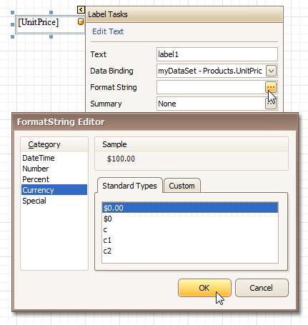

# Change Value Formatting of Report Elements
To apply value formatting for a [data-bound control](displaying-values-from-a-database-(binding-report-elements-to-data).md)'s content (e.g. for it to be treated as currency, or date-time content), locate this control, click its [Smart Tag](../report-designer-reference/report-designer-ui/smart-tag.md), and in the invoked actions list, click the ellipsis button for the **Format String** entry.

Then, in the invoked format string editor, choose one of the predefined formatting styles, or specify a custom one.

To quit the dialog and apply the changes, click **OK**.

Similarly, when the [mail-merge](use-mail-merge-in-report-elements.md) is employed for a control's dynamic content, to apply a value formatting to an embedded data field, select it in the in-place editor, and click the control's smart tag. Then, in the invoked actions list, specify the required format.

Note that when a _summary function_ is being applied to a control's dynamic content, value formatting is applied separately, via the **Summary Editor**, as described at [Add Totals to a Report](add-totals-to-a-report.md).

Independently from the general (or, summary) value formatting, you can specify a native XLSX format string, which is to be preserved when the report is being [exported](../../../print-preview/print-preview-for-winforms/exporting/exporting-from-print-preview.md) to XLSX. This can be done via a control's **Xlsx Format String** property.