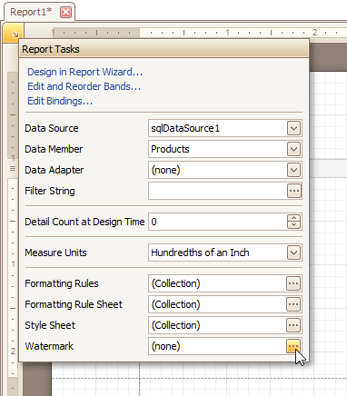
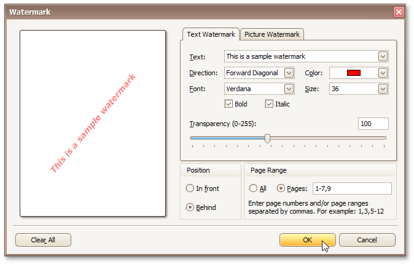
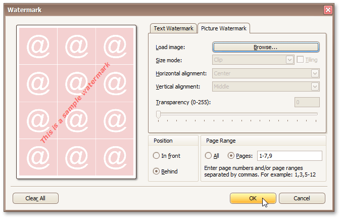

# Create or Modify Watermarks of a Report
This document describes how to add a text _watermark_ in a report, or turn a picture into a report's _background_. Note that watermarks are visible only in [Preview](../report-designer-reference/report-designer-ui/preview-tab.md) and [HTML View](../report-designer-reference/report-designer-ui/html-view-tab.md) modes.

To create a new watermark in a report (or to modify the existing one), do the following.
1. Click the report's [Smart Tag](../report-designer-reference/report-designer-ui/smart-tag.md), and in its actions list, click the ellipsis button for the **Watermark** entry.
	
	
2. In the **Text** tab of the invoked **Watermark** dialog, define the required properties for the text watermark.
	
	
3. Then, switch to the **Picture Watermark** tab to load the image to be used as a watermark, and define its properties, such as Size mode, Alignment (vertical and horizontal), Tiling, Transparency, Page Range, etc.
	
	
	
	As you can see, it is possible to use both textual and image watermarks simultaneously.

The report with watermark is now ready. Switch to the [Preview Tab](../report-designer-reference/report-designer-ui/preview-tab.md), and view the result.

