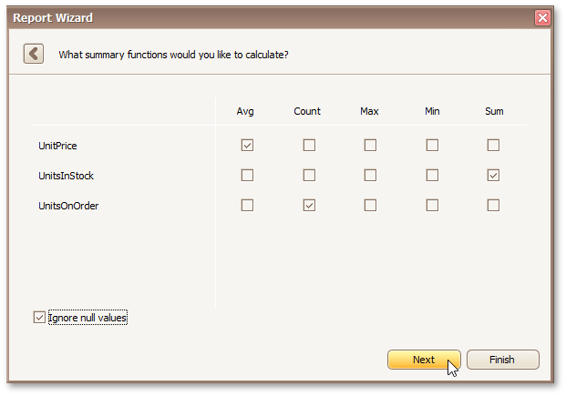

# Specify Summary Options
> [!NOTE]
> This wizard step is only available if you have applied data grouping in the previous step ([Add Grouping Levels](add-grouping-levels.md)). If you have not grouped data, this step is skipped.

Use this wizard page to specify totals to be displayed for each data group and grand totals for the entire report. The specified totals will be displayed after corresponding groups and in the report footer.

This page displays all available numerical and date-time fields that are not used to group data. You can specify which functions should be calculated for these fields using the check box table.

There are instances when data fields contain empty values. If you do not wish to take these values into account when calculating totals, select the **Ignore null values** check box. Otherwise, these values will be treated as zeros for numeric fields and the earliest system date for date-time fields.

You can stop the wizard at this step by clicking **Finish**. In this case, your report will look similar to the image below.

If you want to customize your report further, click **Next** to proceed to the next wizard page: [Choose a Report Layout](choose-a-report-layout.md).