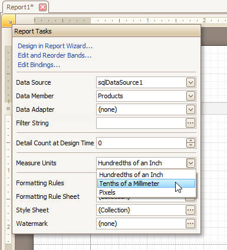
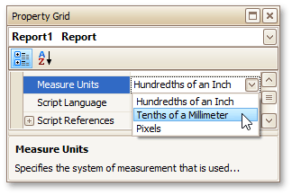

# Change Measurement Units of a Report
For your report, you can choose its global **Measure Units**, which can be **Hundredths of an Inch**, **Tenths of a Millimeter** or **Pixels**.

This can be specified either using the report's [Smart Tag](../../report-designer-reference/report-designer-ui/smart-tag.md) ...

... or via the [Property Grid](../../report-designer-reference/report-designer-ui/property-grid.md).

This defines the basic measurement unit for all the unit-related options of a report and its [bands](../../report-designer-reference/report-bands.md) and [controls](../../report-designer-reference/report-controls.md) (such as _location_, _size_, _border width_, etc.). And, this determines the measurement unit of the report's [Snap Grid](controls-positioning.md).