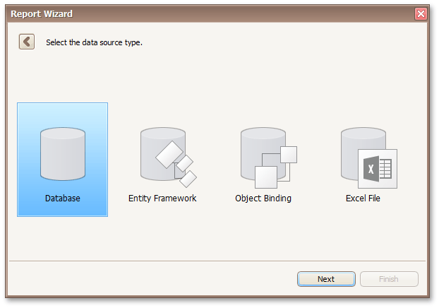
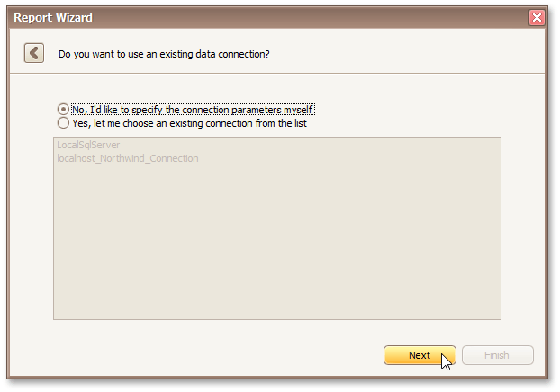
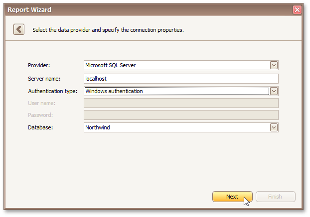
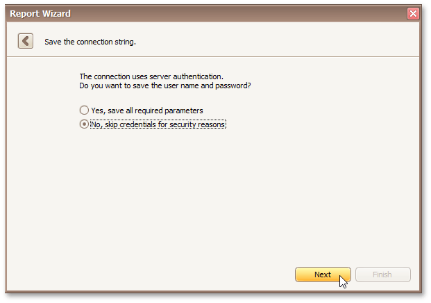
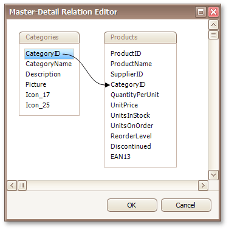
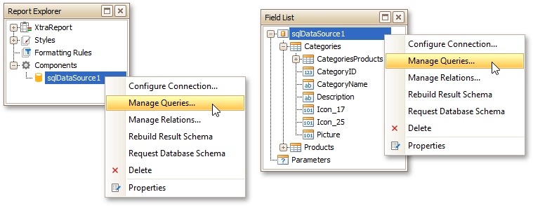

# Bind a Report to a Database
This document describes how to bind a report to a hierarchical data source and specify a master-detail relationship between data source queries.

To accomplish this task, do the following.
1. [Create a new report](../basic-operations/create-a-new-report.md).
2. Click the report's [Smart Tag](../../report-designer-reference/report-designer-ui/smart-tag.md). In the invoked actions list, expand the **Data Source** drop-down list and click **Add New DataSource**.
	
	
3. The first page of the invoked **Data Source Wizard** allows you to specify the data source type. Select **Database** and click **Next** to proceed.
	
	
4. On the next page, specify whether you want to use an existing data connection or create a new data connection from scratch. Select the first option to create a new connection and click **Next**.
	
	
5. On the next wizard page, define a custom connection string or select one of the supported data source types. Depending on the data provider selected, it may be necessary to specify additional connection options (such as authentication type and database name).
	
	
	
	Click **Next** to proceed to the next wizard page.
6. If server authentication is required for the selected database type, the next page will prompt you to specify whether or not you want to save the user credentials along with the connection string.
	
	Select the required option and click **Next**.
	
	
7. On the next page, you can choose which tables, views and/or stored procedures to add to the report.
	
	To create a master-detail report, select two or more tables and click **Manage Relations**.
	
	
	
	In the invoked editor, connect the required key fields (columns) using drag and drop.
	
	
	
	Click **OK** to close the editor.
	
	> [!NOTE]
	> When you are required to shape data at the level of a data source, you can create [custom queries](../../report-wizard/data-bound-report/connect-to-a-database/create-a-query-or-select-a-stored-procedure.md) by expanding the **Queries** category and clicking the  button.
	> 
	> This will invoke the [Query Builder](../../report-designer-reference/report-designer-ui/query-builder.md) where you can create complex queries by joining multiple tables, filtering, sorting and grouping their data, as well as calculating various aggregate functions.
	> 
	> Although it is also possible to join different tables within a single query, creating hierarchical data sources is preferred in most cases to provide better performance (in general, [master-detail reports](../report-types/master-detail-report-(detail-report-bands).md) are generated faster than similar-looking reports created by grouping "flat" data sources).
	
	Click **Finish** to complete the **Data Source Wizard**. If the selected queries or stored procedures contain any [parameters](../../report-editing-basics/use-query-parameters.md), you can go to the [next wizard page](../../report-wizard/data-bound-report/connect-to-a-database/configure-query-parameters.md) and define their values.

The newly created SQL data source will be displayed in the **Components** node of the [Report Explorer](../../report-designer-reference/report-designer-ui/report-explorer.md). Additionally, the hierarchy of the data source will be reflected by the [Field List](../../report-designer-reference/report-designer-ui/field-list.md). In both panels, you can right-click the data source to access its settings.

