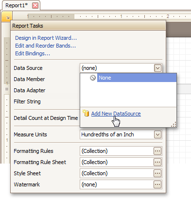
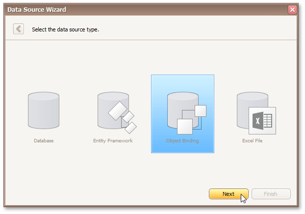
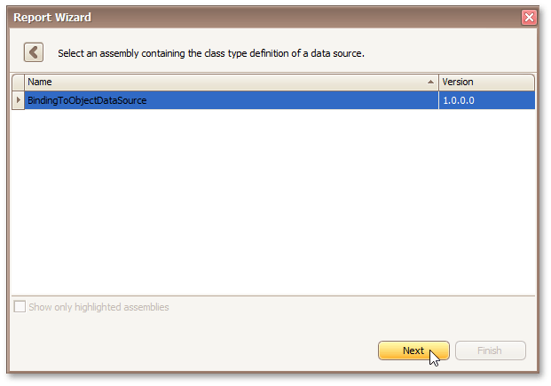
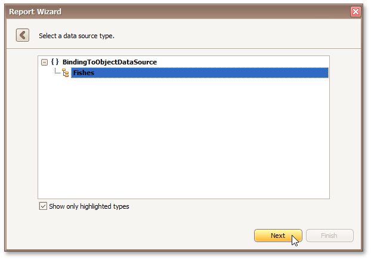
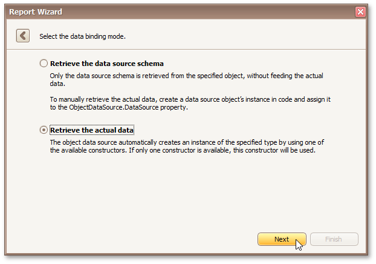
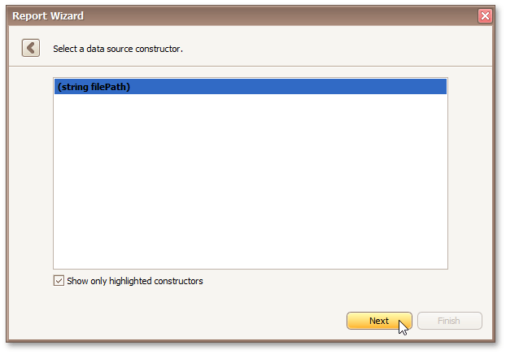
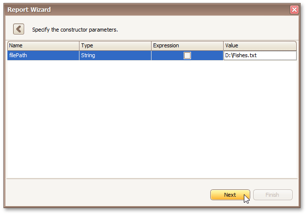

# Bind a Report to an Object Data Source
This document describes the steps required to connect a report to an object data source.

To bind a report to an object data source, do the following.
1. [Create a new report](../basic-operations/create-a-new-report.md).
2. Click the report's [Smart Tag](../../report-designer-reference/report-designer-ui/smart-tag.md). In the invoked actions list, expand the **Data Source** drop-down list and click **Add New DataSource**.
	
	
3. The first page of the invoked **Data Source Wizard** allows you to specify the data source type. Select **Object Binding** and click **Next** to proceed.
	
	
4. Next, select an assembly that contains the class type definition of the data source. To exclude irrelevant assemblies from this list, select the **Show only highlighted assemblies** check box.
	
	
5. On the following wizard page, select a data source type. To exclude irrelevant classes from this list, select the **Show only highlighted classes** check box.
	
	
6. On the next wizard page, select whether you need to retrieve the actual data from the data source or obtain the data source schema (enabling you to edit the report layout without having access to the actual underlying data). Select the second option and click **Next** to proceed.
	
	
7. The following page allows you to select a data source constructor to be used to create an instance of the data source. To exclude irrelevant constructors from the list, select the **Show only highlighted constructors** check box.
	
	
8. On this wizard page, you can specify the parameters for the selected constructor. To specify the constructor parameter's value, use the **Value** column. Enable the check box in the **Expression** column to make it possible to specify the parameter expression using the **Expression Editor**. In this case, you can pass an existing report parameter to the member or even create a new report parameter using the in-place editor.
	
	
	
	Click **Finish** to exit the wizard.

The newly created object data source will be displayed in the **Components** node of the [Report Explorer](../../report-designer-reference/report-designer-ui/report-explorer.md). Additionally, the hierarchy of the data source will be reflected by the [Field List](../../report-designer-reference/report-designer-ui/field-list.md).

