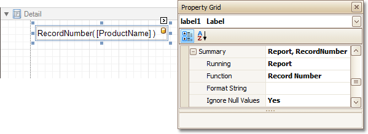

# Show the Current Row Index
This document describes how to accompany every record in a [data-bound report](../binding-a-report-to-data.md) with its current row index.

To show the current row index in a report, use a [Label](../../report-designer-reference/report-controls/label.md) control [bound to a data field](../../report-editing-basics/displaying-values-from-a-database-(binding-report-elements-to-data).md), and specify its **Summary** options in the following way.

The result is shown in the following image.

