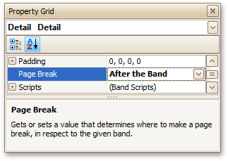
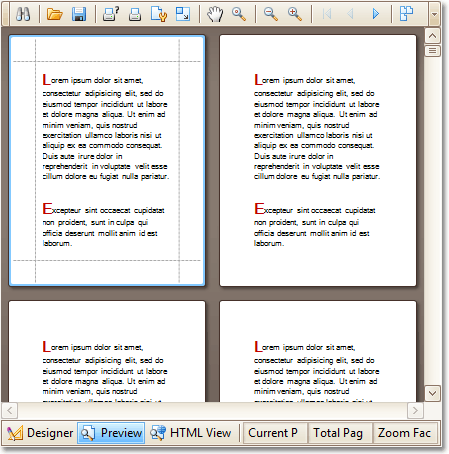

# Static Report
This tutorial describes the steps to create a _static report_, which means that the report will not be bound to a data source. In this example, we will create a simple one-page announcement to be repeated 20 times in a report.

To create a static report, do the following.
1. [Create a new report](../basic-operations/create-a-new-report.md).
2. From the [Control Toolbox](../../report-designer-reference/report-designer-ui/control-toolbox.md), drop the [Rich Text](../../report-designer-reference/report-controls/rich-text.md) control onto the [Detail band](../../report-designer-reference/report-bands/detail-band.md).
	
	
3. Select the created control and click its [Smart Tag](../../report-designer-reference/report-designer-ui/smart-tag.md). In the invoked actions list, click the **Load File...** context link.
	
	
	
	In the invoked dialog, define the path to an RTF or TXT file containing a text of the announcement, and click **Open**.
	
	> [!NOTE]
	> Note that you can perform additional text formatting using the [Formatting Toolbar](../../report-designer-reference/report-designer-ui/formatting-toolbar.md).
4. To repeat the created report 20 times, select the Detail band, expand its **Report Print Options** property in the [Property Grid](../../report-designer-reference/report-designer-ui/property-grid.md) and set the **Detail Count at Design Time** property to **20**.
	
	And, to make the announcement print on separate pages, set the band's **Page Break** property to **After the Band**.
	
	

The static report is now ready. Switch to the [Preview Tab](../../report-designer-reference/report-designer-ui/preview-tab.md), and view the result.

