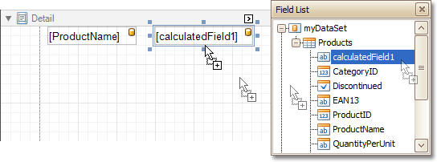

# Conditionally Change a Label's Text
This tutorial demonstrates how to change a label's text if a certain condition is met, without using [scripts](../miscellaneous/handle-events-via-scripts.md).

To conditionally change a label's text, do the following.
1. [Create a new report](../basic-operations/create-a-new-report.md) and [bind it to a data source](../binding-a-report-to-data.md).
2. To create a calculated field, in the [Field List](../../report-designer-reference/report-designer-ui/field-list.md), right-click any item inside the created data source, and on the invoked menu, choose **Add Calculated Field**.
	
	
3. Select the calculated field, and in the [Property Grid](../../report-designer-reference/report-designer-ui/property-grid.md), set its **Field Type** to **String**. Then, click the ellipsis button for its **Expression** property.
	
	And, in the invoked **Expression Editor**, define the required logical condition for the calculated field (e.g. **Iif([UnitsOnOrder] == 0, 'None', [UnitsOnOrder])**, which means that if the **UnitsOnOrder** data field's value is equal to **0**, the control's text will be replaced with **None**).
	
	
	
	To save the changes and close the dialog, click **OK**.
4. Finally, drop the required data fields (and the created calculated field as well) from the Field List onto the report's [Detail](../../report-designer-reference/report-bands/detail-band.md) band.
	
	

The report is now ready. Switch to the [Preview Tab](../../report-designer-reference/report-designer-ui/preview-tab.md), and view the result.

