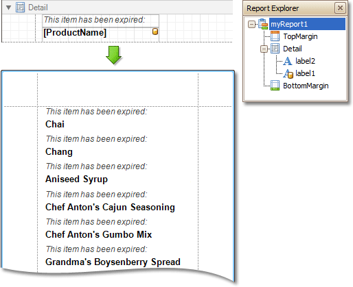

# Detail Band
The **Detail** band is the central part of a report. Unlike other bands, it cannot be deleted - the present report structure includes the Detail band in its core. In a [data-bound report](../../create-reports/binding-a-report-to-data.md), the contents of the Detail band are repeated for every data entry (e.g. if you're building a report listing, say, products, it will be rendered for each product in the database). And, if [static data](../../report-editing-basics/add-or-modify-static-information-in-your-report.md) is also  present in the Detail band, in the resulting report, it is repeated with each new entry.

In the [Property Grid](../report-designer-ui/property-grid.md), the Detail Band's properties are divided into the following groups.

## Appearance
* **Background Color**
	
	Specifies the background color for the controls contained within the band. This option is also available in the [Formatting Toolbar](../report-designer-ui/formatting-toolbar.md) ().
* **Borders**, **Border Color**, **Border Dash Style** and **Border Width**
	
	Specify border settings for the controls contained within the band.
* **Font**
	
	Specifies the font settings for the controls contained within the band. Some of these settings are available in the [Formatting Toolbar](../report-designer-ui/formatting-toolbar.md).
* **Foreground Color**
	
	Specifies the text color for the controls contained within the band. This option is also available in the [Formatting Toolbar](../report-designer-ui/formatting-toolbar.md) ().
* **Formatting Rules**
	
	Invokes the Formatting Rules Editor allowing you to choose which rules should be applied to the band during report generation, and define the precedence of the applied rules. To learn more on this, refer to [Conditionally Change a Control's Appearance](../../create-reports/styles-and-conditional-formatting/conditionally-change-a-controls-appearance.md).
* **Padding**
	
	Specifies indent values which are used to render the contents of the controls contained within the band.
* **Style Priority**
	
	Allows you to define the priority of various style elements (such as background color, border color, etc.). For more information on style inheritance, refer to [Understanding Style Concepts](../../create-reports/styles-and-conditional-formatting/understanding-style-concepts.md).
* **Styles**
	
	This property allows you to define [odd and even styles](../../create-reports/styles-and-conditional-formatting/use-odd-and-even-styles.md) for the controls contained within the band, as well as to assign an existing style to them (or a newly created one). For more information on style inheritance, refer to [Understanding Style Concepts](../../create-reports/styles-and-conditional-formatting/understanding-style-concepts.md).
* **Text Alignment**
	
	Allows you to change the text alignment of the controls contained within the band. This option is also available in the [Formatting Toolbar](../report-designer-ui/formatting-toolbar.md).

## Behavior
* **Drill-Down Control**
	
	Specifies a control used to expand/collapse the current report band. This property provides automatic [drill-down](../../create-reports/report-types/drill-down-report.md) functionality to report bands.
* **Drill-Down Expanded**
	
	Specifies whether the current report band is expanded or collapsed when using the automatic [drill-down](../../create-reports/report-types/drill-down-report.md) feature.
* **Keep Together**
	
	As stated above, the detail band is printed repeatedly for every data entry. When the Keep Together option is on, the report engine tries to keep sequential detail band entries together. This option makes sense only when data is grouped or you're working with a master-detail report. In this case, the report engine tries to keep group contents on one page. If a group doesn't fit and it starts somewhere in the middle of a page, the report moves this group to a new page, thus trying to reduce the number of page breaks in continuous data.
* **Keep Together with Detail Reports**
	
	Specifies whether or not the current detail band band should always be printed on the same page, together with its child [Detail Report Band](detail-report-band-for-master-detail-reports.md).
* **Multi-Column Options**
	
	This property allows you to arrange the printout of the band's content in several columns. For more information, refer to [Multi-Column Report](../../create-reports/report-types/multi-column-report.md).
* **Page Break**
	
	Use this property if the current report design requires that the detail section should be separated from previous sections or follow-ups. Specify the Before the Band or After the Band values to insert a page break before or after the current band. In many cases, this property may be used instead of the [Page Break](../report-controls/page-break.md) control.
* **Scripts**
	
	This property contains events, which you can handle by the required scripts. For more information on scripting, refer to [Handle Events via Scripts](../../create-reports/miscellaneous/handle-events-via-scripts.md).
* **Visible**
	
	Specifies whether the band should be visible in print preview.

## Data
* **Sort Fields**
	
	Invokes the Group Field Collection Editor, which enables you to specify the fields for sorting the records within the band, the sorting order for each field and the order sequence. For more information, refer to [Change or Apply Data Sorting to a Report](../../report-editing-basics/change-or-apply-data-sorting-to-a-report.md).
* **Tag**
	
	This property allows you to add some additional information to the band; for example its id, by which it can then be accessible via [scripts](../../create-reports/miscellaneous/handle-events-via-scripts.md).

## Design
* **(Name)**
	
	Determines a band's name, by which it can be accessed in the [Report Explorer](../report-designer-ui/report-explorer.md), [Property Grid](../report-designer-ui/property-grid.md) or via [scripts](../../create-reports/miscellaneous/handle-events-via-scripts.md).

## Layout
* **Height**
	
	Specifies the band's height, in [report measurement units](../../create-reports/basic-operations/change-measurement-units-of-a-report.md).
* **Snap Line Padding**
	
	Specifies the padding (in [report measurement units](../../create-reports/basic-operations/change-measurement-units-of-a-report.md)), which is to be preserved within the band when controls it contains are [aligned using Snap Lines](../../create-reports/basic-operations/controls-positioning.md).

## Structure
* **Sub-Bands**
	
	Allows you to invoke the Sub-Band Collection Editor intended to manage and customize the band's collection of [sub-bands](sub-bands.md).