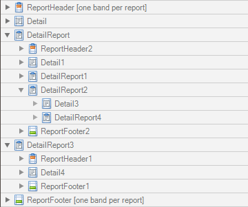
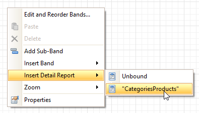

# Detail Report Band for Master-Detail Reports
The **Detail Report** band is a type of band used to incorporate one report into another in [master-detail reports](../../create-reports/report-types/master-detail-report-(detail-report-bands).md). It is quite different from the [Detail band](detail-band.md), since it holds the whole _detail_ report in a _master-detail_ report layout, and therefore can contain other types of bands within it.

There can be an unlimited number of Detail Report bands nested inside one another.

To add a Detail Report band, use the [Context Menu](../report-designer-ui/context-menu.md). If the [bound data source](../../create-reports/binding-a-report-to-data.md) contains a _data relationship_, the submenu will contain an item with its name. Otherwise, add an unbound detail report and specify its data binding options later.

In the [Property Grid](../report-designer-ui/property-grid.md), the properties of this band are divided into the following groups.

## Appearance
* **Background Color**
	
	Specifies the background color for the controls contained within the band. This option is also available in the [Formatting Toolbar](../report-designer-ui/formatting-toolbar.md) ().
* **Borders**, **Border Color**, **Border Dash Style** and **Border Width**
	
	Specify border settings for the controls contained within the band.
* **Font**
	
	Specifies the font settings for the controls contained within the band. Some of these settings are available in the [Formatting Toolbar](../report-designer-ui/formatting-toolbar.md).
* **Foreground Color**
	
	Specifies the text color for the controls contained within the band. This option is also available in the [Formatting Toolbar](../report-designer-ui/formatting-toolbar.md) ().
* **Formatting Rules**
	
	Invokes the Formatting Rules Editor, allowing you to choose which rules should be applied to the band during report generation, and define the precedence of the applied rules. To learn more on this, refer to [Conditionally Change a Control's Appearance](../../create-reports/styles-and-conditional-formatting/conditionally-change-a-controls-appearance.md).
* **Padding**
	
	Specifies indent values which are used to render the contents of the controls contained within the band.
* **Text Alignment**
	
	Allows you to change the text alignment of the controls contained within the band. This option is also available in the [Formatting Toolbar](../report-designer-ui/formatting-toolbar.md).

## Behavior
* **Drill-Down Control**
	
	Specifies a control used to expand/collapse the current detail report band. This property provides automatic [drill-down](../../create-reports/report-types/drill-down-report.md) functionality to report bands.
* **Drill-Down Expanded**
	
	Specifies whether the current detail report band is expanded or collapsed when using the automatic [drill-down](../../create-reports/report-types/drill-down-report.md) feature.
* **Level**
	
	Specifies the order of several Detail Report Band objects in a report. It allows the reordering of different Detail Report Bands at the same level of [master-detail relationships](../../create-reports/report-types/master-detail-report-(detail-report-bands).md). The lower the level number, the closer the band is to the Detail band.
* **Page Break**
	
	Use this property if the current report design requires that the band's section should be separated from previous sections or follow-ups. Specify the Before the Band or After the Band values to insert a page break before or after the current band. In many cases, this property may be used instead of the [Page Break](../report-controls/page-break.md) control.
* **Scripts**
	
	This property contains events which you can handle with the required scripts. For more information on scripting, refer to [Handle Events via Scripts](../../create-reports/miscellaneous/handle-events-via-scripts.md).
* **Visible**
	
	Specifies whether the band should be visible in print preview.

## Data
* **Data Adapter**
	
	Determines a Detail Report Band's data adapter that provides the detail data for the report. To learn more, refer to [Master-Detail Report (Detail Report Bands)](../../create-reports/report-types/master-detail-report-(detail-report-bands).md).
* **Data Member**
	
	Determines a name of the data relationship established within the bound data source. To learn more, refer to [Master-Detail Report (Detail Report Bands)](../../create-reports/report-types/master-detail-report-(detail-report-bands).md).
* **Data Source**
	
	Determines the data source that provides the detail data for the report. If this property isn't defined, the detail report gets data from the master report's data source. To learn more, refer to [Master-Detail Report (Detail Report Bands)](../../create-reports/report-types/master-detail-report-(detail-report-bands).md).
* **Filter String**
	
	Allows you to invoke the Filter String Editor, which is intended to easily define a filtering condition for a detail report's data. For more information, refer to [Change or Apply Data Filtering to a Report](../../report-editing-basics/change-or-apply-data-filtering-to-a-report.md).
* **Tag**
	
	This property allows you to add some additional information to the band; for example its id, by which it can then be accessible via [scripts](../../create-reports/miscellaneous/handle-events-via-scripts.md).
* **XML Data Path**
	
	Allows you to define a path to the data contained in an XML file. The data contained in the file will then be used as the Detail Report Band's data source.
	
	In this case, the Data Member property will specify the bound list in the XML data source.
	
	> [!NOTE]
	> Note that a detail report uses the XML Data Path property value only when the Data Source property is set to None. The XML Data Path property has a lower priority than the Data Source property.

## Design
* **(Name)**
	
	Determines a band's name, by which it can be accessed in the [Report Explorer](../report-designer-ui/report-explorer.md), [Property Grid](../report-designer-ui/property-grid.md) or via [scripts](../../create-reports/miscellaneous/handle-events-via-scripts.md).

## Printing
**Report Print Options**

Provides the following options that define how a report is printed in various circumstances.
* **Blank Detail Count**
	
	Specifies how many times the empty detail band is repeated before printing the regular data.
* **Detail Count**
	
	Specifies the maximum number of times the detail band will be printed when a data source is defined for the report, and it is not empty.
* **Detail Count at Design Time**
	
	Specifies how many times the detail band is printed when a report is being previewed.
* **Detail Count when Data Source is Empty**
	
	Specifies how many times the detail band should be printed when no data source is defined for the report
* **Print when Data Source is Empty**
	
	Specifies whether or not a report should be printed if its data source is empty.

## Structure
* **Bands**
	
	Allows you to invoke the Report Editor intended to manage and customize the report's bands.