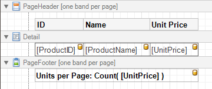

# Page Header and Footer
The **Page Header** and **Page Footer** bands are located at the top and bottom of every page in a report.

The Page Header/Footer bands are the best place for information that should be printed on every page. For example, use them to display the header of a table which is continued from the previous page (an example can be found at the [Table Report](../../create-reports/report-types/table-report.md) tutorial).

> [!NOTE]
> If you insert page break right after the [Report Header](report-header-and-footer.md) (by setting its **Page Break** to **After the Band**),  the Page Footer and Page Header bands will not be printed on the first page.

In the [Property Grid](../report-designer-ui/property-grid.md), the properties of these bands are divided into the following groups.

## Appearance
* **Background Color**
	
	Specifies the background color for the controls contained within the band. This option is also available in the [Formatting Toolbar](../report-designer-ui/formatting-toolbar.md) ().
* **Borders**, **Border Color**, **Border Dash Style** and **Border Width**
	
	Specify border settings for the controls contained within the band.
* **Font**
	
	Specifies the font settings for the controls contained within the band. Some of these settings are available in the [Formatting Toolbar](../report-designer-ui/formatting-toolbar.md).
* **Foreground Color**
	
	Specifies the text color for the controls contained within the band. This option is also available in the [Formatting Toolbar](../report-designer-ui/formatting-toolbar.md) ().
* **Formatting Rules**
	
	Invokes the Formatting Rules Editor, allowing you to choose which rules should be applied to the band during report generation, and define the precedence of the applied rules. To learn more on this, refer to [Conditionally Change a Control's Appearance](../../create-reports/styles-and-conditional-formatting/conditionally-change-a-controls-appearance.md).
* **Padding**
	
	Specifies indent values which are used to render the contents of the controls contained within the bands.
* **Style Priority**
	
	Allows you to define the priority of various style elements (such as background color, border color, etc.). For more information on style inheritance, refer to [Understanding Style Concepts](../../create-reports/styles-and-conditional-formatting/understanding-style-concepts.md).
* **Styles**
	
	This property allows you to define [odd and even styles](../../create-reports/styles-and-conditional-formatting/use-odd-and-even-styles.md) for the controls contained within the bands, as well as to assign an existing style to them (or a newly created one). For more information on style inheritance, refer to [Understanding Style Concepts](../../create-reports/styles-and-conditional-formatting/understanding-style-concepts.md).
* **Text Alignment**
	
	Allows you to change the text alignment of the controls contained within the bands. This option is also available in the [Formatting Toolbar](../report-designer-ui/formatting-toolbar.md).

## Behavior
* **Print On**
	
	This property specifies whether the band should be printed on the same page with [Report Header and Report Footer](report-header-and-footer.md) bands.
* **Scripts**
	
	This property contains events, which you can handle with the required scripts. For more information on scripting, refer to [Handle Events via Scripts](../../create-reports/miscellaneous/handle-events-via-scripts.md).
* **Visible**
	
	Specifies whether the band should be visible in print preview.

## Data
* **Tag**
	
	This property allows you to add some additional information to the band; for example its id, by which it can then be accessible via [scripts](../../create-reports/miscellaneous/handle-events-via-scripts.md).

## Design
* **(Name)**
	
	Determines a band's name, by which it can be accessed in the [Report Explorer](../report-designer-ui/report-explorer.md), [Property Grid](../report-designer-ui/property-grid.md) or via [scripts](../../create-reports/miscellaneous/handle-events-via-scripts.md).

## Layout
* **Height**
	
	Specifies the band's height, in [report units](../../create-reports/basic-operations/change-measurement-units-of-a-report.md).
* **Snap Line Padding**
	
	Specifies the padding (in [report measurement units](../../create-reports/basic-operations/change-measurement-units-of-a-report.md)), which is to be preserved within the band when controls it contains are [aligned using Snap Lines](../../create-reports/basic-operations/controls-positioning.md).

## Structure
* **Sub-Bands**
	
	Allows you to invoke the Sub-Band Collection Editor intended to manage and customize the band's collection of [sub-bands](sub-bands.md).