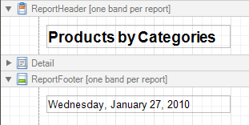

# Report Header and Footer
The **Report Header** and **Report Footer** are the only types of report bands rendered once per report.

The **Report Header** is the first band of a report on the first page (not counting [margins](page-margin-bands.md) as they are "out-of-page" zones). The Report Header also precedes the [Page Header](page-header-and-footer.md), making it the best place to display the report's name, company logo, [date of creation and user name](../../report-editing-basics/add-page-numbers-and-system-information-to-a-report.md), etc.

And, if you plan to add a [Chart](../report-controls/chart.md) that visualizes the report's data, place this control onto this band.

The **Report Footer** finalizes the informative part of the report. It is placed before the [Page Footer](page-header-and-footer.md) and [Bottom Margin](page-margin-bands.md) on the report's last page. Use the Report Footer for report [grand totals](../../report-editing-basics/add-totals-to-a-report.md) or conclusions.

In the [Property Grid](../report-designer-ui/property-grid.md), the properties of these bands are divided into the following groups.

## Appearance
* **Background Color**
	
	Specifies the background color for the controls contained within the band. This option is also available in the [Formatting Toolbar](../report-designer-ui/formatting-toolbar.md) ().
* **Borders**, **Border Color**, **Border Dash Style** and **Border Width**
	
	Specify border settings for the controls contained within the band.
* **Font**
	
	Specifies the font settings for the controls contained within the band. Some of these settings are available in the [Formatting Toolbar](../report-designer-ui/formatting-toolbar.md).
* **Foreground Color**
	
	Specifies the text color for the controls contained within the band. This option is also available in the [Formatting Toolbar](../report-designer-ui/formatting-toolbar.md) ().
* **Formatting Rules**
	
	Invokes the Formatting Rules Editor allowing you to choose which rules should be applied to the band during report generation, and define the precedence of the applied rules. To learn more on this, refer to [Conditionally Change a Control's Appearance](../../create-reports/styles-and-conditional-formatting/conditionally-change-a-controls-appearance.md).
* **Padding**
	
	Specifies indent values which are used to render the contents of the controls contained within the bands.
* **Style Priority**
	
	Allows you to define the priority of various style elements (such as background color, border color, etc.). For more information on style inheritance, refer to [Understanding Style Concepts](../../create-reports/styles-and-conditional-formatting/understanding-style-concepts.md).
* **Styles**
	
	This property allows you to define [odd and even styles](../../create-reports/styles-and-conditional-formatting/use-odd-and-even-styles.md) for the controls contained within the bands, as well as to assign an existing style to them (or a newly created one). For more information on style inheritance, refer to [Understanding Style Concepts](../../create-reports/styles-and-conditional-formatting/understanding-style-concepts.md).
* **Text Alignment**
	
	Allows you to change the text alignment of the controls contained within the bands. This option is also available in the [Formatting Toolbar](../report-designer-ui/formatting-toolbar.md).

## Behavior
* **Keep Together**
	
	When this option is on, the report tries to fit the band contents entirely on one page, not allowing it to split across several pages. In general, if the contents are too large to fit on a single page, then the band is started on a new page, and continues on the following page.
* **Page Break**
	
	Use this property if the current report design requires that the band's section should be separated from previous sections or follow-ups. Specify the Before the Band or After the Band values to insert a page break before or after the current band. In many cases, this property may be used instead of the [Page Break](../report-controls/page-break.md) control.
* **Print at Bottom**
	
	This property is available for the Report Footer band only, and determines whether this band should be printed at the bottom of the last page, or immediately after the last report's details. The Report Footer has priority over the [Group Footer](grouping-bands.md)'s Print at Bottom property, so the Group Footer can never be placed after the Report Footer.
* **Scripts**
	
	This property contains events, which you can handle with the required scripts. For more information on scripting, refer to [Handle Events via Scripts](../../create-reports/miscellaneous/handle-events-via-scripts.md).
* **Visible**
	
	Specifies whether the band should be visible in print preview.

## Data
* **Tag**
	
	This property allows you to add some additional information to the band; for example its id, by which it can then be accessible via [scripts](../../create-reports/miscellaneous/handle-events-via-scripts.md).

## Design
* **(Name)**
	
	Determines a band's name, by which it can be accessed in the [Report Explorer](../report-designer-ui/report-explorer.md), [Property Grid](../report-designer-ui/property-grid.md) or via [scripts](../../create-reports/miscellaneous/handle-events-via-scripts.md).

## Layout
* **Height**
	
	Specifies the band's height, in [report units](../../create-reports/basic-operations/change-measurement-units-of-a-report.md).
* **Snap Line Padding**
	
	Specifies the padding (in [report measurement units](../../create-reports/basic-operations/change-measurement-units-of-a-report.md)), which is to be preserved within the band when controls it contains are [aligned using Snap Lines](../../create-reports/basic-operations/controls-positioning.md).

## Structure
* **Sub-Bands**
	
	Allows you to invoke the Sub-Band Collection Editor intended to manage and customize the band's collection of [sub-bands](sub-bands.md).