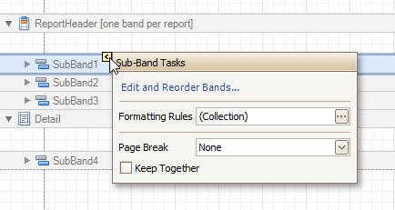

# Sub-Bands
The sub-band is a band that provides a functional copy of the source band below which it is located.

A sub-band's behavior, as well as its position within the report band hierarchy, is dictated by the source band type. A band can have an unlimited number of sub-bands. Adding sub-bands is provided for all types of bands except for the [Page Margin Bands](page-margin-bands.md) and the sub-band itself.

Using sub-bands, it is possible to create multiple versions of a band within a single report (e.g., to choose an appropriate version later based on a [specific condition](../../create-reports/styles-and-conditional-formatting/conditionally-hide-bands.md)).

In the [Property Grid](../report-designer-ui/property-grid.md), the sub-band's properties are divided into the following groups.

## Appearance
* **Background Color**
	
	Specifies the background color for the controls contained within the band. This option is also available in the [Formatting Toolbar](../report-designer-ui/formatting-toolbar.md) ().
* **Borders**, **Border Color**, **Border Dash Style** and **Border Width**
	
	Specify border settings for the controls contained within the band.
* **Font**
	
	Specifies the font settings for the controls contained within the band. Some of these settings are available in the [Formatting Toolbar](../report-designer-ui/formatting-toolbar.md).
* **Foreground Color**
	
	Specifies the text color for the controls contained within the band. This option is also available in the [Formatting Toolbar](../report-designer-ui/formatting-toolbar.md) ().
* **Formatting Rules**
	
	Invokes the Formatting Rules Editor allowing you to choose which rules should be applied to the band during report generation and define the precedence of the applied rules. To learn more, refer to [Conditionally Change a Control's Appearance](../../create-reports/styles-and-conditional-formatting/conditionally-change-a-controls-appearance.md) and [Conditionally Hide Bands](../../create-reports/styles-and-conditional-formatting/conditionally-hide-bands.md).
* **Padding**
	
	Specifies indent values used to render the contents of the controls contained within the band.
* **Style Priority**
	
	Allows you to define the priority of various style elements (such as background color, border color, etc.). For more information on style inheritance, refer to [Understanding Style Concepts](../../create-reports/styles-and-conditional-formatting/understanding-style-concepts.md).
* **Styles**
	
	This property allows you to define [odd and even styles](../../create-reports/styles-and-conditional-formatting/use-odd-and-even-styles.md) for the controls contained within the band, as well as to assign an existing style to them (or a newly created one). For more information on style inheritance, refer to [Understanding Style Concepts](../../create-reports/styles-and-conditional-formatting/understanding-style-concepts.md).
* **Text Alignment**
	
	Allows you to change the text alignment of the controls contained within the band. This option is also available in the [Formatting Toolbar](../report-designer-ui/formatting-toolbar.md).

## Behavior
* **Keep Together**
	
	When this option is enabled, the report tries to fit the band contents entirely on one page without splitting across several pages. In general, if the contents are too large to fit on a single page, then the band is started on a new page and continues on the following page.
* **Page Break**
	
	Use this property if the current report design requires that the band section should be separated from previous sections or follow-ups. Specify the Before the Band or After the Band values to insert a page break before or after the current band. In many cases, this property may be used instead of the [Page Break](../report-controls/page-break.md) control.
* **Scripts**
	
	This property contains events, which you can handle by the required scripts. For more information on scripting, refer to [Handle Events via Scripts](../../create-reports/miscellaneous/handle-events-via-scripts.md).
* **Visible**
	
	Specifies whether the band should be visible in print preview.

## Data
* **Tag**
	
	This property allows you to add additional information to the band (for example, its id by which it can then be accessed using [scripts](../../create-reports/miscellaneous/handle-events-via-scripts.md)).

## Design
* **(Name)**
	
	Determines a band's name by which it can be accessed in the [Report Explorer](../report-designer-ui/report-explorer.md), [Property Grid](../report-designer-ui/property-grid.md) or via [scripts](../../create-reports/miscellaneous/handle-events-via-scripts.md).

## Layout
* **Height**
	
	Specifies the band's height in [report measurement units](../../create-reports/basic-operations/change-measurement-units-of-a-report.md).
* **Snap Line Padding**
	
	Specifies the padding (in [report measurement units](../../create-reports/basic-operations/change-measurement-units-of-a-report.md)), which is to be preserved within the band when controls it contains are [aligned using Snap Lines](../../create-reports/basic-operations/controls-positioning.md).