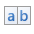

# Report Controls
The documents in this section describe options of each report control available in the Report Designer.

In general, _report controls_ allow you to represent information of different kinds (e.g. simple or formatted text, pictures, tables, etc.) in you report both [static](../report-editing-basics/add-or-modify-static-information-in-your-report.md) and [dynamic](../report-editing-basics/displaying-values-from-a-database-(binding-report-elements-to-data).md), and to adjust your report's layout (by organizing controls within panels, and inserting page breaks at the required positions).

In the Report Designer, the available controls are listed in the [Control Toolbox](report-designer-ui/control-toolbox.md) from which they are dropped onto the required [bands](report-bands.md).

You also can extend the standard functionality of each control by writing scripts for its available events.

This document consists of the following sections.
* [Available Controls](#controls)
* [Add Controls to a Report](#add)

## <a name="controls"/>Available Controls
The following table lists the available controls (in the same order as in the [Control Toolbox](report-designer-ui/control-toolbox.md)). For each control's options description, refer to the corresponding document.

| Icon | Control | Description |
|---|---|---|
|  | [Label](report-controls/label.md) | The most basic **Label** control is intended to display text in your report. It can represent [static](../report-editing-basics/add-or-modify-static-information-in-your-report.md) or [dynamic](../report-editing-basics/displaying-values-from-a-database-(binding-report-elements-to-data).md) text, or [both](../report-editing-basics/use-mail-merge-in-report-elements.md). In addition, it can be used to calculate standard summary functions across a data field. The Label's text can only be formatted as a whole. So, if it's required to differently format parts of text, use the [Rich Text](report-controls/rich-text.md) control. |
|  | [Character Comb](report-controls/character-comb.md) | The **Character Comb** control displays text so that each character is printed in an individual cell. |
|  | [Check Box](report-controls/check-box.md) | The **Check Box** control is intended to display True/False or Checked/Unchecked/Indeterminate states in a report, by displaying (or not) a check mark, which can be accompanied by a text description. |
|  | [Rich Text](report-controls/rich-text.md) | The **Rich Text** control allows you to display formatted text in your report. It can represent [static](../report-editing-basics/add-or-modify-static-information-in-your-report.md) or [dynamic](../report-editing-basics/displaying-values-from-a-database-(binding-report-elements-to-data).md) text, or [both](../report-editing-basics/use-mail-merge-in-report-elements.md). You can load content to the Rich Text from an external TXT or RTF file (which can also contain images) and then format any part of it. The formatting options include font face, styles and sizes, and color. |
|  | [Picture Box](report-controls/picture-box.md) | The **Picture Box** control is intended to display images of numerous formats in a report. An image can be loaded from an external file,  from a [bound data source](../create-reports/binding-a-report-to-data.md), or from a web location using the specified URL. |
|  | [Panel](report-controls/panel.md) | The **Panel** control is a container that frames separate report controls to allow them to be easily moved, copied and pasted, and visually unite them in the report's preview (with borders or a uniform color background). |
|  | [Table](report-controls/table.md) | The **Table** control is designed to arrange information in a [tabular layout](../create-reports/report-types/table-report.md). It may contain any number of [Rows](report-controls/table-row.md) comprised of individual [Cells](report-controls/table-cell.md). Both Rows and Cells can be selected and customized individually. In most aspects, a Cell is similar to a [Label](report-controls/label.md), but can also contain other controls (e.g. [Picture Box](report-controls/picture-box.md) or [Rich Text](report-controls/rich-text.md)). |
|  | [Line](report-controls/line.md) | The **Line** control draws a line of a specified direction, style, width and color. It can be used for both decoration and visual separation of a report's sections. The Line cannot cross [bands](report-bands.md), as opposed to the [Cross-band Line](report-controls/cross-band-line.md) control. |
|  | [Shape](report-controls/shape.md) | The **Shape** control allows you to embed simple graphic objects into your report. You can choose one of multiple predefined shapes (e.g. rectangles, ellipses, arrows, polygons, crosses and brackets of various kinds). |
|  | [Bar Code](report-controls/bar-code.md) | The **Bar Code** control transforms its content into a bar code of the specified type. Multiple standard bar code symbologies are supported. |
|  | [Zip Code](report-controls/zip-code.md) | The **Zip Code** control renders a numeric postal code that is used to identify the mail address in some countries. This control is not related to the Zone Improvement Plan (ZIP) code used by the United States Postal Service. |
|  | [Chart](report-controls/chart.md) | The **Chart** is a sophisticated control used to embed graphs into your report. It graphically represents a _series_ of _points_ using numerous 2D or 3D chart types. A Chart can be populated with points both _manually_ (by specifying _arguments_ and _values_ for each point) and _dynamically_ (by connecting it to the report's data source, or binding it to a separate one). |
|  | [Gauge](report-controls/gauge.md) | The **Gauge** control provides you with the capability to embed graphical gauges into your report. |
|  | [Sparkline](report-controls/sparkline.md) | The **Sparkline** control displays a compact chart that is commonly used to reflect the flow of data for every row in a report. |
|  | [Pivot Grid](report-controls/pivot-grid.md) | The **Pivot Grid** control represents dynamic data (obtained from an underlying data source) in a cross-tabulated form to create [cross-tab reports](../create-reports/report-types/cross-tab-report.md), similar to Pivot Tables in Microsoft Excel&#174;. Column headers display unique values from one data field, and row headers - from another field. Each cell displays a summary for the corresponding row and column values. By specifying different data fields, you can see different totals. This allows you to get a compact layout for a complex data analysis. |
|  | [Page Info](report-controls/page-info.md) | The **Page Info** control is intended to [add page numbers and system information](../report-editing-basics/add-page-numbers-and-system-information-to-a-report.md) (the current date and time or the current user name) into your report. As with many other controls, you can [format](../report-editing-basics/change-value-formatting-of-report-elements.md) this control's content. |
|  | [Page Break](report-controls/page-break.md) | The **Page Break** control's sole purpose is to insert a page delimiter at any point within a report. |
|  | [Cross-band Line](report-controls/cross-band-line.md) | The **Cross-band Line** control allows you to draw a line through several [bands](report-bands.md). This can be useful if it is required to visually emphasize a section consisting of multiple band areas. In other aspects, it is similar to a regular [Line](report-controls/line.md). |
|  | [Cross-band Box](report-controls/cross-band-box.md) | The **Cross-band Box** control allows you to draw a rectangle through several [bands](report-bands.md). This can be useful if it is required to visually encompass a section consisting of multiple band areas. |
|  | [Table of Contents](report-controls/table-of-contents.md) | The **Table of Contents** control generates a table of contents based on bookmarks specified for report elements. |
|  | [Subreport](report-controls/subreport.md)&nbsp;&nbsp;&nbsp;&nbsp;&nbsp;&nbsp;&nbsp;&nbsp;&nbsp;&nbsp; | The **Subreport** control allows you to include other reports in your current report. |

## <a name="add"/>Add Controls to a Report
To create a control, drag it from the [Toolbox](report-designer-ui/control-toolbox.md) panel onto the report area.

To automatically create a control bound to data, drag a field from the [Field List](report-designer-ui/field-list.md) panel, and drop it onto a report's surface. When dropping a field onto an existing control, this control will be bound to the data field.

If you drag the field with the right mouse button,  when the button is released the context menu is invoked. Use this menu to specify which control should be created.

To learn more on data binding for report controls, refer to [Displaying Values from a Database (Binding Report Elements to Data)](../report-editing-basics/displaying-values-from-a-database-(binding-report-elements-to-data).md).

> [!NOTE]
> When controls overlap, the report may be shown incorrectly when [exported](../../../print-preview/print-preview-for-winforms/exporting/exporting-from-print-preview.md) to some formats. Red markers and a report tooltip will warn of this situation. You may switch off the red warning marks via the [report](report-settings.md)'s **Show Export Warnings** property.

To learn how report controls can be relocated and resized, refer to [Change the Layout of Report Elements](../report-editing-basics/change-the-layout-of-report-elements.md) and [Controls Positioning](../create-reports/basic-operations/controls-positioning.md).