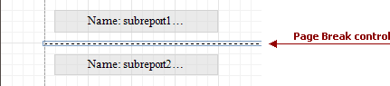

# Page Break
The **Page Break** control's sole purpose is to insert a page delimiter at any point within a report.

This control is visually represented by a short line, attached to the report's left margin, as shown in the following image.

The Page Break control is useful when you need to insert a page break between controls within a [band](../report-bands.md) - for example, to divide subreports, so that the second subreport starts printing on a new page. Another example of the Page Break's use can be found in the following tutorial: [Limit the Number of Records per Page](../../create-reports/miscellaneous/limit-the-number-of-records-per-page.md).

> [!NOTE]
> Note that when you need a page break before or after printing a certain band, you may set its **Page Break** property to **Before the Band** or **After the Band**, instead of using the Page Break control.

In the [Property Grid](../report-designer-ui/property-grid.md), the Page Break control's properties are divided into the following groups.

## Appearance
* **Formatting Rules**
	
	Invokes the Formatting Rules Editor, allowing you to choose which rules should be applied to the control during report generation, and define the precedence of the applied rules. To learn more on this, refer to [Conditionally Change a Control's Appearance](../../create-reports/styles-and-conditional-formatting/conditionally-change-a-controls-appearance.md).

## Behavior
* **Scripts**
	
	This property contains events, which you can handle with the required scripts. For more information on scripting, refer to [Handle Events via Scripts](../../create-reports/miscellaneous/handle-events-via-scripts.md).
* **Visible**
	
	Specifies whether the control should be visible in print preview.

## Design
* **(Name)**
	
	Determines a control's name, by which it can be accessed in the [Report Explorer](../report-designer-ui/report-explorer.md), [Property Grid](../report-designer-ui/property-grid.md) or via [scripts](../../create-reports/miscellaneous/handle-events-via-scripts.md).

## Layout
* **Location**
	
	Specifies the control's location, measured in [report units](../../create-reports/basic-operations/change-measurement-units-of-a-report.md).
* **Snap Line Margin**
	
	Specifies the margin (measured in [report units](../../create-reports/basic-operations/change-measurement-units-of-a-report.md)), which is to be preserved around the control when it is [aligned using Snap Lines](../../create-reports/basic-operations/controls-positioning.md), or when other controls are aligned next to it.