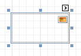

# Picture Box
The **Picture Box** control is intended to display images of numerous formats in a report. An image can be loaded from an external file,  from a [bound data source](../../create-reports/binding-a-report-to-data.md), or from a web location using the specified URL.

The following image formats are supported: BMP, DIB, RLE, JPG, JPEG, JPE, JFIF, GIF, EMF, WMF, TIF, TIFF, PNG and ICO.

To quickly load an image from an external file, use the control's [Smart Tag](../report-designer-ui/smart-tag.md).

To bind the control to a data field containing images, right-click the corresponding [Field List](../report-designer-ui/field-list.md) item, and then drag and drop it onto a report. This will invoke the [Context Menu](../report-designer-ui/context-menu.md), where you can choose the **Picture Box**, and it will be automatically created and bound to the selected data field.

In the [Property Grid](../report-designer-ui/property-grid.md), the Picture Box control's properties are divided into the following groups.

## Appearance
* **Background Color**
	
	Specifies the background color for the control.
* **Borders**, **Border Color**, **Border Dash Style** and **Border Width**
	
	Specify border settings for the control.
* **Formatting Rules**
	
	Invokes the Formatting Rules Editor allowing you to choose which rules should be applied to the control during report generation, and define the precedence of the applied rules. To learn more on this, refer to [Conditionally Change a Control's Appearance](../../create-reports/styles-and-conditional-formatting/conditionally-change-a-controls-appearance.md).
* **Padding**
	
	Specifies indent values which are used to render the contents of the control.
* **Style Priority**
	
	Allows you to define the priority of various style elements (such as background color, border color, etc.). For more information on style inheritance, refer to [Understanding Style Concepts](../../create-reports/styles-and-conditional-formatting/understanding-style-concepts.md).
* **Styles**
	
	Specifies [odd and even styles](../../create-reports/styles-and-conditional-formatting/use-odd-and-even-styles.md) for the control and enables you to assign an existing style to the control (or a newly created one). To learn more, see [Understanding Style Concepts](../../create-reports/styles-and-conditional-formatting/understanding-style-concepts.md).

## Behavior
* **Anchor Horizontally**
	
	Specifies the horizontal anchoring style of the control, so that after page rendering it stays attached to the left control, right control, or both. This property defines how a report control is resized to maintain the distance to the left and right edges of its container control.
* **Anchor Vertically**
	
	Specifies the vertical anchoring style of the control, so that after page rendering it stays attached to the top control, bottom control, or both. The property setting is useful for data-bound controls located between upper and lower controls, which are allowed to resize depending on their contents.
* **Can Publish**
	
	Specifies whether or not a report control is displayed in a printed or exported document.
* **Image Alignment**
	
	Specifies the alignment of a displayed image in relation to the control's boundaries.
* **Keep Together**
	
	Specifies whether the contents of the control can be horizontally split across pages. In other words, if the control occupies more space than remains on the page, this property specifies whether this control should be split between the current page and the next, or whether it will be printed entirely on the next page. This property is in effect only when the control's content does not fit on the current page. If it does not fit on the next page either, then the control will be split despite this property's value.
* **Process Duplicates Mode**
	
	Specifies how to process report controls with duplicate values.
* **Process Duplicates Target**
	
	Specifies whether to process duplicate values of the Image, or Tag property.
* **Process Null Values**
	
	Specifies how to process a Picture Box control receiving a null value from a connected data source.
* **Scripts**
	
	This property contains events, which you can handle with the required scripts. For more information on scripting, refer to [Handle Events via Scripts](../../create-reports/miscellaneous/handle-events-via-scripts.md).
* **Sizing**
	
	Defines the sizing mode of a contained image. To quickly adjust the image size and position within the control, click its Smart Tag, and choose **Sizing**.
	
	
	
	The image sizing settings are briefly described in the following table.

| Mode | Description |
|---|---|
| **Normal** | The image is placed in the upper-left corner of the control. The image is clipped if it is larger than the Picture Box which contains it. |
| **Stretch Image** | The image within the control is stretched or shrunk to fit the size of a Picture Box. |
| **Auto-Size** | The Picture Box size is adjusted to that of the image it contains. |
| **Center Image** | The image is displayed in the center of the control. If the image is larger than the Picture Box, the outer edges are clipped. |
| **Zoom Image** | The image is sized proportionally (without clipping) for best fit into the control. |
| **Squeeze** | If the dimensions of a Picture Box exceed that of the image it contains, the image is centered and shown full-size. Otherwise, the image is resized to fit into the Picture Box's dimensions. |
| **Tile** | The original image is replicated within the Picture Box starting from the upper-left corner. The replicated image is clipped if it doesn't fit in the Picture Box which contains it. |
* **Visible**
	
	Specifies whether the control should be visible in print preview.

## Data
* **(Data Bindings)**
	
	If the current report is [bound to data](../../create-reports/binding-a-report-to-data.md), this property allows you to bind some of the control's properties (Bookmark, Image, Image URL, Navigation URL and Tag) to a data field obtained from the report's data source, and to apply a [format string](../../report-editing-basics/change-value-formatting-of-report-elements.md) to it. For more information on this, refer to [Displaying Values from a Database (Binding Report Elements to Data)](../../report-editing-basics/displaying-values-from-a-database-(binding-report-elements-to-data).md).
* **Image**
	
	Specifies an image to display in the Picture Box control.
	
	When you click the ellipsis button, you will see the Open File dialog that enables you to specify the file to load. Then, this image is embedded into a report and saved within this report, so it is always available. Note that this increases the size of a [saved report definition](../../report-editing-basics/back-up-the-current-layout-before-modifying-it.md). If you want to save only the image path, and not the image itself, use the Image URL property instead.
* **Image URL**
	
	Specifies the URL of the image to display in the Picture Box control. It supports both absolute and relative paths. A relative path may be related to the Web site or to the current Web page. In the second case, the path to the image must start with the "~" symbol. Setting a relative path makes it easier to move the entire application to another directory on the server without having to update the code.
* **Tag**
	
	This property allows you to add some additional information to the control; for example its id, by which it can then be accessible via [scripts](../../create-reports/miscellaneous/handle-events-via-scripts.md).
	
	If the current [report has a data source](../../create-reports/binding-a-report-to-data.md), the Tag property can be bound to a data field obtained from the data source. To do this, expand the (Data Bindings) property and in the Tag.Binding drop-down selector, select the required data field.

## Design
* **(Name)**
	
	Determines a control's name, by which it can be accessed in the [Report Explorer](../report-designer-ui/report-explorer.md), [Property Grid](../report-designer-ui/property-grid.md) or via [scripts](../../create-reports/miscellaneous/handle-events-via-scripts.md).

## Layout
* **Location**
	
	Specifies the control's location, measured in [report units](../../create-reports/basic-operations/change-measurement-units-of-a-report.md).
* **Size**
	
	Specifies the control's size, measured in [report units](../../create-reports/basic-operations/change-measurement-units-of-a-report.md).
* **Snap Line Margin**
	
	Specifies the margin (measured in [report units](../../create-reports/basic-operations/change-measurement-units-of-a-report.md)), which is to be preserved around the control when it is [aligned using Snap Lines](../../create-reports/basic-operations/controls-positioning.md), or when other controls are aligned next to it.

## Navigation
* **Bookmark** and **Parent Bookmark**
	
	These properties are intended for the creation of a hierarchical structure within a report called a document map. For an explanation and help, refer to [Add Bookmarks](../../create-reports/report-navigation-and-interactivity/add-bookmarks.md).
	
	If the current [report has a data source](../../create-reports/binding-a-report-to-data.md), the Bookmark property can be bound to a data field obtained from the data source. To do this, expand the (Data Bindings) property and in the Bookmark.Binding drop-down selector, select the required data field.
* **Navigation URL** and **Navigation Target**
	
	Use the Navigation URL property to specify a URL for web browser navigation when a user clicks the control. The web browser displays a page in a window or a frame as specified by the Navigation Target property. Note that a URL should have an appropriate prefix (e.g. "http://"). You can create cross-references within the report by assigning the name of the target control to the Navigation URL property, and setting the Navigation Target property to "_self". For more information, refer to [Create Hyperlinks](../../create-reports/report-navigation-and-interactivity/create-hyperlinks.md).
	
	If the current [report has a data source](../../create-reports/binding-a-report-to-data.md), the Navigation URL property can be bound to a data field obtained from the data source. To do this, expand the (Data Bindings) property and in the Navigation URL.Binding drop-down selector, select the required data field.