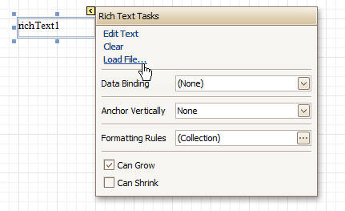

# Rich Text
The **Rich Text** control allows you to display formatted text in your report. It can represent [static](../../report-editing-basics/add-or-modify-static-information-in-your-report.md) or [dynamic](../../report-editing-basics/displaying-values-from-a-database-(binding-report-elements-to-data).md) text, or [both](../../report-editing-basics/use-mail-merge-in-report-elements.md). You can load content to the Rich Text from an external TXT or RTF file (which can also contain images) and then format any part of it. The formatting options include font face, styles and sizes, and color.

A content from an external TXT or RTF file can be loaded to this control via its [Smart Tag](../report-designer-ui/smart-tag.md).

In the [Property Grid](../report-designer-ui/property-grid.md), the Rich Text control's properties are divided into the following groups.

## Appearance
* **Background Color**
	
	Specifies the background color for the control. This option is also available in the [Formatting Toolbar](../report-designer-ui/formatting-toolbar.md) ().
* **Borders**, **Border Color**, **Border Dash Style** and **Border Width**
	
	Specify border settings for the control.
* **Font**
	
	Specifies the font settings for the control. Some of these settings are available in the [Formatting Toolbar](../report-designer-ui/formatting-toolbar.md).
* **Foreground Color**
	
	Specifies the text color for the control. This option is also available in the [Formatting Toolbar](../report-designer-ui/formatting-toolbar.md) ().
* **Formatting Rules**
	
	Invokes the Formatting Rules Editor allowing you to choose which rules should be applied to the control during report generation, and define the precedence of the applied rules. To learn more on this, refer to [Conditionally Change a Control's Appearance](../../create-reports/styles-and-conditional-formatting/conditionally-change-a-controls-appearance.md).
* **Padding**
	
	Specifies indent values which are used to render the contents of the control.
* **Style Priority**
	
	Allows you to define the priority of various style elements (such as background color, border color, etc.). For more information on style inheritance, refer to [Understanding Style Concepts](../../create-reports/styles-and-conditional-formatting/understanding-style-concepts.md).
* **Styles**
	
	Specifies [odd and even styles](../../create-reports/styles-and-conditional-formatting/use-odd-and-even-styles.md) for the control and enables you to assign an existing style to the control (or a newly created one). To learn more, see [Understanding Style Concepts](../../create-reports/styles-and-conditional-formatting/understanding-style-concepts.md).

## Behavior
* **Anchor Horizontally**
	
	Specifies the horizontal anchoring style of the control, so that after page rendering it stays attached to the left control, right control, or both. This property defines how a report control is resized to maintain the distance to the left and right edges of its container control.
* **Anchor Vertically**
	
	Specifies the vertical anchoring style of the control, so that after page rendering it stays attached to the top control, bottom control, or both. The property setting is useful for data-bound controls located between upper and lower controls, which are allowed to resize depending on their contents.
	
	Note that if the Anchor Vertically property is set to Bottom or Both, the Can Grow and Can Shrink properties (see below) values are ignored, and don't participate in calculating a final height value of this control.
* **Can Grow**
	
	When this property is set to Yes, the control's height can be automatically increased, if required, to display the text. If there are other controls below the current control, they will be pushed down to prevent them from overlapping. Note that if a control overlaps the growing Rich Text by even one pixel, it will not be pushed down by the growing Rich Text.
* **Can Publish**
	
	Specifies whether or not a report control is displayed in a printed or exported document.
* **Can Shrink**
	
	When this property is set to Yes, and the text does not completely fill a Rich Text, then the control's height will be decreased to the height of its text. If there are other controls below the current one, they will be moved up to fill the gap. Note that if a control overlaps the shrinking Rich Text by even one pixel, it will not be pushed up by the shrinking Rich Text.
* **Keep Together**
	
	Specifies whether the contents of the control can be horizontally split across pages. In other words, if the control occupies more space than remains on the page, this property specifies whether this control should be split between the current page and the next, or whether it will be printed entirely on the next page. This property is in effect only when the control's content does not fit on the current page. If it does not fit on the next page either, then the control will be split despite this property's value.
* **Process Duplicates**
	
	Determines the control's behavior when its data source contains consecutive repeating records. They can be processed as is (when the property is set to Leave), suppressed except for the first entry (Suppress) and suppressed with the blank space printed instead of the repeated records (Suppress and Shrink).
* **Process Null Values**
	
	Determines whether to process Null (blank) values if they appear in the control's data source. They can be processed as is (when the property is set to Leave), suppressed (Suppress) and suppressed with the blank space printed instead of the blank records (Suppress and Shrink).
* **Scripts**
	
	This property contains events, which you can handle with the required scripts. For more information on scripting, refer to [Handle Events via Scripts](../../create-reports/miscellaneous/handle-events-via-scripts.md).
* **Visible**
	
	Specifies whether the control should be visible in print preview.

## Data
* **(Data Bindings)**
	
	If the current report is [bound to data](../../create-reports/binding-a-report-to-data.md), this property allows you to bind some of the control's properties (Bookmark, Html, Navigation URL, Rtf and Tag) to a data field obtained from the report's data source, and to apply a [format string](../../report-editing-basics/change-value-formatting-of-report-elements.md) to it. For more information on this, refer to [Displaying Values from a Database (Binding Report Elements to Data)](../../report-editing-basics/displaying-values-from-a-database-(binding-report-elements-to-data).md).
* **Lines**
	
	Provides access to the Text property of the control, allowing you to input multiple lines of static text.
* **Null Value Text**
	
	Specifies the text displayed by a control when the value of its bound data field is null.
* **Tag**
	
	This property allows you to add some additional information to the control; for example its id, by which it can then be accessible via [scripts](../../create-reports/miscellaneous/handle-events-via-scripts.md).
	
	If the current [report has a data source](../../create-reports/binding-a-report-to-data.md), the Tag property can be bound to a data field obtained from the data source. To do this, expand the (Data Bindings) property, and in the Tag.Binding drop-down selector, select the required data field.
* **Text**
	
	Allows you to define a line of static text to be displayed. To type several lines of text, use the Lines property. Note that when the control is selected in the designer, you may simply start typing the text, and it will be automatically entered into the in-place editor.
	
	
	
	If the current [report has a data source](../../create-reports/binding-a-report-to-data.md), the Rtf property (instead of Text) can be bound to a data field obtained from the data source. To do this, expand the (Data Bindings) property and in the Rtf.Binding drop-down selector, select the required data field. For more information on this, refer to [Displaying Values from a Database (Binding Report Elements to Data)](../../report-editing-basics/displaying-values-from-a-database-(binding-report-elements-to-data).md).

## Design
* **(Name)**
	
	Determines a control's name, by which it can be accessed in the [Report Explorer](../report-designer-ui/report-explorer.md), [Property Grid](../report-designer-ui/property-grid.md) or via [scripts](../../create-reports/miscellaneous/handle-events-via-scripts.md).

## Layout
* **Location**
	
	Specifies the control's location, measured in [report units](../../create-reports/basic-operations/change-measurement-units-of-a-report.md).
* **Size**
	
	Specifies the control's size, measured in [report units](../../create-reports/basic-operations/change-measurement-units-of-a-report.md).
* **Snap Line Margin**
	
	Specifies the margin (measured in [report units](../../create-reports/basic-operations/change-measurement-units-of-a-report.md)), which is to be preserved around the control when it is [aligned using Snap Lines](../../create-reports/basic-operations/controls-positioning.md), or when other controls are aligned next to it.

## Navigation
* **Bookmark** and **Parent Bookmark**
	
	These properties are intended for the creation of a hierarchical structure within a report, called a document map. For an explanation and help, refer to [Add Bookmarks](../../create-reports/report-navigation-and-interactivity/add-bookmarks.md).
	
	If the current [report has a data source](../../create-reports/binding-a-report-to-data.md), the Bookmark property can be bound to a data field obtained from the data source. To do this, expand the (Data Bindings) property and in the Bookmark.Binding drop-down selector, select the required data field.
* **Navigation URL** and **Navigation Target**
	
	Use the Navigation URL property to specify a URL for web browser navigation when a user clicks the control. The web browser displays a page in a window or a frame as specified by the Navigation Target property. Note that a URL should have an appropriate prefix (e.g. "http://"). You can create cross-references within the report by assigning the name of the target control to the Navigation URL property, and setting the Navigation Target property to "_self". For more information, refer to [Create Hyperlinks](../../create-reports/report-navigation-and-interactivity/create-hyperlinks.md).
	
	If the current [report has a data source](../../create-reports/binding-a-report-to-data.md), the Navigation URL property can be bound to a data field obtained from the data source. To do this, expand the (Data Bindings) property, and in the Navigation URL.Binding drop-down selector, select the required data field.