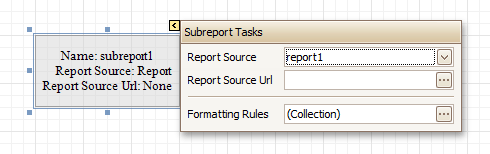

# Subreport
The **Subreport** control allows you to include other reports in your current report.

There are several reasons for using subreports. The first one is to _reuse_ reports. This can be of help if there is a particular report structure (_template_) that has to be included in all reports, and the report must have consistent appearance and functionality. A good example is a report header that contains the company information, logo, date, etc. The second reason for using subreports is creation of _master-detail_ reports (or, _invoice_ reports with hierarchically linked data).

However, for master-detail reports creation, another approach is recommended: [using Detail Report bands](../../create-reports/report-types/master-detail-report-(detail-report-bands).md).

You can click a subreport, to open the report to which it is linked in a new [Design Panel](../report-designer-ui/design-panel.md).

In the [Property Grid](../report-designer-ui/property-grid.md), the Subreport's properties are divided into the following groups.

## Appearance
* **Formatting Rules**
	
	Invokes the Formatting Rules Editor allowing you to choose which rules should be applied to the control during report generation, and define the precedence of the applied rules. To learn more on this, refer to [Conditionally Change a Control's Appearance](../../create-reports/styles-and-conditional-formatting/conditionally-change-a-controls-appearance.md).

## Behavior
* **Can Shrink**
	
	Determines whether a Subreport's height should be decreased if its contents don't completely fill the control.
	
	Use this property to specify whether the height of the Subreport control should be taken into account when generating a report. This may be required, because usually the mutual location of report controls is considered when generating a report document. But, as the Subreport control actually represents a report itself, the height of a Subreport normally should not be taken into account in the generated report document.
	
	Also, note that there is no Can Grow option for the Subreport control, as it always increases its height depending on its contents.
* **Scripts**
	
	This property contains events, which you can handle by the required scripts. For more information on scripting, refer to [Handle Events via Scripts](../../create-reports/miscellaneous/handle-events-via-scripts.md).
* **Visible**
	
	Specifies a value indicating whether the current control should be printed (when set to Yes) or hidden (No) on report generation.

## Data
* **Parameter Bindings**
	
	Provides access to the collection of subreport parameter bindings, which allow you to bind a subreport's parameter value to a master report's data field.
* **Report Source**
	
	Determines a report to be included as a subreport.
	
	If report classes of the application that invoked the Report Designer are compiled into one assembly, then they are available as items in this combo box.
* **Report Source Url**
	
	Defines an URL of a report definition file (*.REPX), to be used as a report source.

## Design
* **(Name)**
	
	Determines a control's name, by which it can be accessed in the [Report Explorer](../report-designer-ui/report-explorer.md), [Property Grid](../report-designer-ui/property-grid.md) or via [scripts](../../create-reports/miscellaneous/handle-events-via-scripts.md).

## Layout
* **Location**
	
	Specifies the control's location, measured in [report units](../../create-reports/basic-operations/change-measurement-units-of-a-report.md).
* **Size**
	
	Specifies the control's size, measured in [report units](../../create-reports/basic-operations/change-measurement-units-of-a-report.md).
	
	The Subreport isn't limited by the visible size of the control. The size of its actual content is taken into account when rendering the subreport on the page. Note that depending on its contents, its width is unlimited and its height is increased.
* **Snap Line Margin**
	
	Specifies the margin (measured in [report units](../../create-reports/basic-operations/change-measurement-units-of-a-report.md)), which is to be preserved around the control when it is [aligned using Snap Lines](../../create-reports/basic-operations/controls-positioning.md), or when other controls are aligned next to it.