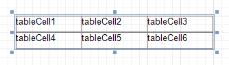
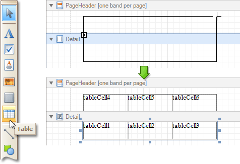

# Table
The **Table** control is designed to arrange information in a [tabular layout](../../create-reports/report-types/table-report.md). It may contain any number of [Rows](table-row.md) comprised of individual [Cells](table-cell.md). Both Rows and Cells can be selected and customized individually. In most aspects, a Cell is similar to a [Label](label.md), but can also contain other controls (e.g. [Picture Box](picture-box.md) or [Rich Text](rich-text.md)).

When a Table is dropped onto a [band](../report-bands.md) from the [Toolbox](../report-designer-ui/control-toolbox.md), it has one row and three columns. If you click and drag over several bands, the resulting table will be split by the bands into several tables. This creates a table header and the detail table with one mouse move.

When you drag and drop an entire data table from the [Field List](../report-designer-ui/field-list.md), a Table with cells bound to the corresponding data fields is created automatically.

A table's elements are managed by using its [Context Menu](../report-designer-ui/context-menu.md).

The whole Table, or its individual Row or Cell can be selected either in the [Report Designer](../report-designer-ui/designer-tab.md), the [Report Explorer](../report-designer-ui/report-explorer.md) or the drop-down selector of the [Property Grid](../report-designer-ui/property-grid.md).

In the [Property Grid](../report-designer-ui/property-grid.md), the Table's properties are divided into the following groups.

## Appearance
* **Background Color**
	
	Specifies the background color for the control. This option is also available in the [Formatting Toolbar](../report-designer-ui/formatting-toolbar.md) ().
* **Borders**, **Border Color**, **Border Dash Style** and **Border Width**
	
	Specify border settings for the control.
* **Font**
	
	Specifies the font settings for the control. Some of these settings are available in the [Formatting Toolbar](../report-designer-ui/formatting-toolbar.md).
* **Foreground Color**
	
	Specifies the text color for the control. This option is also available in the [Formatting Toolbar](../report-designer-ui/formatting-toolbar.md) ().
* **Formatting Rules**
	
	Invokes the Formatting Rules Editor, allowing you to choose which rules should be applied to the control during report generation, and define the precedence of the applied rules. To learn more on this, refer to [Conditionally Change a Control's Appearance](../../create-reports/styles-and-conditional-formatting/conditionally-change-a-controls-appearance.md).
* **Padding**
	
	Specifies indent values which are used to render the contents of a Table's cells.
* **Style Priority**
	
	Allows you to define the priority of various style elements (such as background color, border color, etc.). For more information on style inheritance, refer to [Understanding Style Concepts](../../create-reports/styles-and-conditional-formatting/understanding-style-concepts.md).
* **Styles**
	
	Specifies [odd and even styles](../../create-reports/styles-and-conditional-formatting/use-odd-and-even-styles.md) for the control and enables you to assign an existing style to the control (or a newly created one). To learn more, see [Understanding Style Concepts](../../create-reports/styles-and-conditional-formatting/understanding-style-concepts.md).
* **Text Alignment**
	
	Allows you to change the alignment of a Table's text. This option is also available in the [Formatting Toolbar](../report-designer-ui/formatting-toolbar.md).

## Behavior
* **Anchor Horizontally**
	
	Specifies the horizontal anchoring style of the control, so that after page rendering it stays attached to the left control, right control, or both. This property defines how a report control is resized to maintain the distance to the left and right edges of its container control.
* **Anchor Vertically**
	
	Specifies the vertical anchoring style of a Table, so that after page rendering it stays attached to the top control, bottom control, or both.
* **Can Publish**
	
	Specifies whether or not a report control is displayed in a printed or exported document.
* **Keep Together**
	
	Specifies whether the contents of a Table can be horizontally split across pages. In other words, if a Table occupies more space than remains on the page, this property specifies whether the Table should be split between the current page and the next, or whether it will be printed entirely on the next page. This property is in effect only when a Table's content does not fit on the current page. If it does not fit on the next page either, then the Table will be split despite this property's value.
* **Scripts**
	
	This property contains events, which you can handle with the required scripts. For more information on scripting, refer to [Handle Events via Scripts](../../create-reports/miscellaneous/handle-events-via-scripts.md).
* **Visible**
	
	Specifies whether the control should be visible in print preview.

## Data
* **(Data Bindings)**
	
	If the current report is [bound to data](../../create-reports/binding-a-report-to-data.md), this property allows you to bind some of the control's properties (Bookmark and Tag) to a data field obtained from the report's data source, and to apply a [format string](../../report-editing-basics/change-value-formatting-of-report-elements.md) to it. For more information on this, refer to [Displaying Values from a Database (Binding Report Elements to Data)](../../report-editing-basics/displaying-values-from-a-database-(binding-report-elements-to-data).md).
* **Tag**
	
	This property allows you to add some additional information to the control; for example its id, by which it can then be accessible via [scripts](../../create-reports/miscellaneous/handle-events-via-scripts.md).

## Design
* **(Name)**
	
	Determines a control's name, by which it can be accessed in the [Report Explorer](../report-designer-ui/report-explorer.md), [Property Grid](../report-designer-ui/property-grid.md) or via [scripts](../../create-reports/miscellaneous/handle-events-via-scripts.md).

## Layout
* **Location**
	
	Specifies the control's location, measured in [report units](../../create-reports/basic-operations/change-measurement-units-of-a-report.md).
* **Size**
	
	Specifies the control's size, measured in [report units](../../create-reports/basic-operations/change-measurement-units-of-a-report.md).
* **Snap Line Margin**
	
	Specifies the margin (measured in [report units](../../create-reports/basic-operations/change-measurement-units-of-a-report.md)), which is to be preserved around the control when it is [aligned using Snap Lines](../../create-reports/basic-operations/controls-positioning.md), or when other controls are aligned next to it.

## Navigation
* **Bookmark** and **Parent Bookmark**
	
	These properties are intended for the creation of a hierarchical structure within a report called a document map. For an explanation and help, refer to [Add Bookmarks](../../create-reports/report-navigation-and-interactivity/add-bookmarks.md).
	
	If the current [report has a data source](../../create-reports/binding-a-report-to-data.md), the Bookmark property can be bound to a data field obtained from the data source. To do this, expand the (Data Bindings) property and in the Bookmark.Binding drop-down selector, select the required data field.

## Printing
* **Right to Left**
	
	Specifies the direction of text within cells contained in a table. Use this option to correctly render text written in right-to-left languages.
	
	By default, all report controls have this property set to Inherit, so enabling it for a report will apply this setting to all its controls.
	
	The right-to-left layout is preserved when [exporting a report](../../../../print-preview/print-preview-for-winforms/exporting/exporting-from-print-preview.md) to any of the supported formats (e.g., PDF, Excel, or RTF).