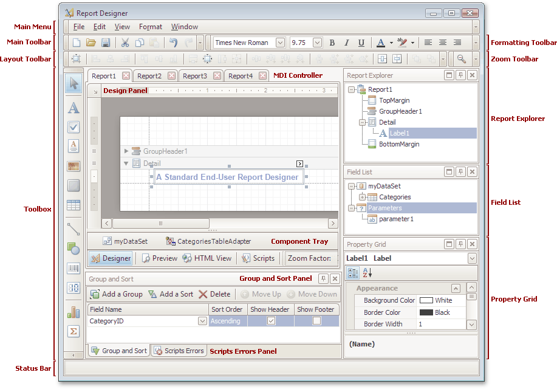

# Report Designer Elements
This document describes elements that comprise the Report Designer that is intended for creating and editing reports.

The following image illustrates a Report Designer.

The following table lists all main interface elements of the Report Designer.

| Element | Description |
|---|---|
| [Main Menu](main-menu.md) | Contains a set of items and subitems that allow you to perform common actions over the report currently shown in the [Design Panel](design-panel.md). It duplicates all the toolbar buttons available on the [Main](main-toolbar.md), [Formatting](formatting-toolbar.md) and [Layout](layout-toolbar.md) toolbars. The **Window** menu allows for the disabling of the tabbed multi-document interface and the tiling of [Design Panel](design-panel.md) windows vertically or horizontally. |
| [Main Toolbar](main-toolbar.md) | The main file management toolbar in the Designer. It contains buttons that allow you to create new reports, save and load report layouts, cut, copy and paste controls, and undo and redo actions in the Designer. |
| [Layout Toolbar](layout-toolbar.md) | The toolbar for positioning report elements. It contains buttons that provide the ability to change the size and location of groups of controls. |
| [Toolbox](control-toolbox.md) | Contains the available controls that you can add to your report by dragging and dropping their icons onto a report's area. |
| [Formatting Toolbar](formatting-toolbar.md) | Contains buttons for text formatting. This toolbar can be also used when a control's text (or its section) is edited via the In-Place editor. |
| [Zoom Toolbar](zoom-toolbar.md) | Provides means for zooming in and out of your report (both in design and preview modes). |
| **MDI Controller** | Provides the multi-document interface in the Designer by containing its [Design Panels](design-panel.md). |
| [Design Panel](design-panel.md) | A surface where a report is being edited and previewed. The Designer provides a multi-document interface, and can have as many [Design Panels](design-panel.md) as required, each associated with a single report instance. Each Design Panel has four tabs ([Designer](designer-tab.md), [Preview](preview-tab.md), [HTML View](html-view-tab.md) and [Scripts](scripts-tab.md)) for report editing, previewing, and maintaining its scripts. |
| [Component Tray](component-tray.md) | Shows components related to report data binding. You can click them to display and edit their settings using the [Property Grid](property-grid.md). |
| [Report Explorer](report-explorer.md) | Displays the structure of a report in a visual-tree form, which makes the report navigation easier. |
| [Field List](field-list.md) | Shows the structure of a report's data source and is used to bind report controls to data. |
| [Property Grid](property-grid.md) | Used to access and modify properties of a report and all its elements (bands and controls). |
| [Group and Sort Panel](group-and-sort-panel.md) | Allows you to quickly perform grouping and sorting operations throughout a report, and visually represents the report's grouping structure. |
| [Scripts Errors Panel](scripts-errors-panel.md) | When errors are found in a report's scripts (after clicking **Validate** in the [Scripts Tab](scripts-tab.md)), it lists these errors. Clicking an error opens the corresponding script section in the Scripts tab. |
| [Status Bar](status-bar.md) | Provides tips and specific information about the Designer element being hovered by a cursor or an action being currently performed. |