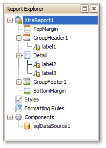
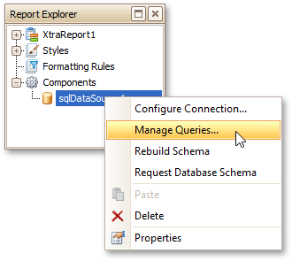
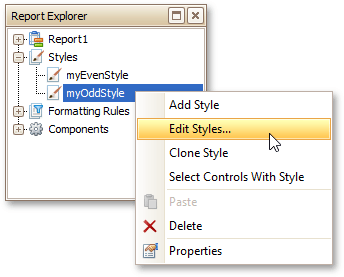

# Report Explorer
The **Report Explorer** shows a report's structure in a tree-like form providing easy access to report elements. Additionally, the **Report Explorer** contains the **Components** node, which displays non-visual report components, such as data objects created when binding a report to a data source.

Once a report element or component has been selected in the Report Explorer, its settings can be changed using the [Property Grid](property-grid.md). You can also right-click elements and components to invoke their context menu.

The **Report Explorer** also provides quick access to all [styles](../../create-reports/styles-and-conditional-formatting/understanding-style-concepts.md) and [formatting rules](../../create-reports/styles-and-conditional-formatting/conditionally-change-a-controls-appearance.md) available for a report. You can manage styles and formatting rules using commands available in context menus. To invoke a context menu, right-click the corresponding root node or their sub-node.

To apply a style or formatting rule to a report control, drag it from the Report Explorer onto the required report control.

If the Report Explorer is hidden, you can enable it in the [Main Menu](main-menu.md) by selecting **View** | **Windows** | **Report Explorer**.