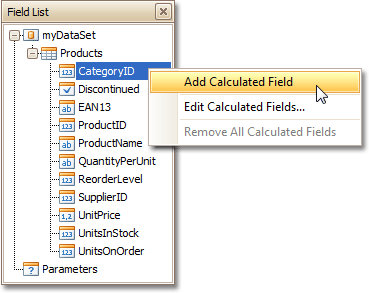
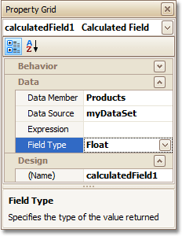
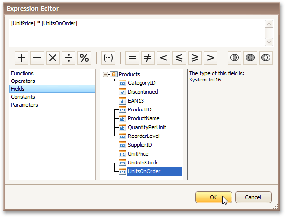
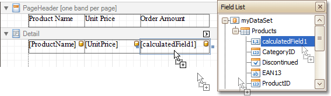

# Add Calculated Fields to a Report
This document demonstrates how to add a _calculated field_ to a report. The main purpose of calculated fields is to perform pre-calculations (of virtually any level of complexity) over [data fields](displaying-values-from-a-database-(binding-report-elements-to-data).md). To learn how to easily perform simple calculations within a single data field, refer to [Add Totals to a Report](add-totals-to-a-report.md).

In the Report Designer, a calculated field is similar to an ordinary data field (e.g. you can bind controls to it, and [group](change-or-apply-data-grouping-to-a-report.md), [sort](change-or-apply-data-sorting-to-a-report.md) and [filter](change-or-apply-data-filtering-to-a-report.md) your report against it).

To add a calculated field to your report, follow the instructions below.
1. To create a calculated field, in the [Field List](../report-designer-reference/report-designer-ui/field-list.md), right-click any data member, and on the invoked menu, choose **Add Calculated Field**.
	
	
2. In the Field List, select the created field to show its properties in the [Property Grid](../report-designer-reference/report-designer-ui/property-grid.md). Among these options, make sure to change the **Field Type** property to an appropriate value.
	
	
3. Now, let's create an expression for the calculated field.
	
	Click the ellipsis button in the **Expression** section, to invoke the **Expression Editor**. You can also invoke this dialog by right-clicking your calculated field within the Field List and selecting **Edit Expression...**
	
	
	
	Click **Fields** to see the field list. Double-click field names to add them to the expression string. Use the toolbar to add operators between field names.
	
	> [!NOTE]
	> Note that it's also possible to employ [parameters](add-parameters-to-a-report.md) in a calculated field's expression.
	
	To close the dialog and save the expression, click **OK**.
4. Finally, drag the calculated field from the Field List onto the required [band](../report-designer-reference/report-bands.md), just like an ordinary data field.
	
	

The report with a calculated field is now ready. Switch to the [Preview Tab](../report-designer-reference/report-designer-ui/preview-tab.md), and view the result.

