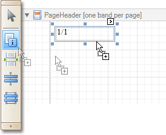
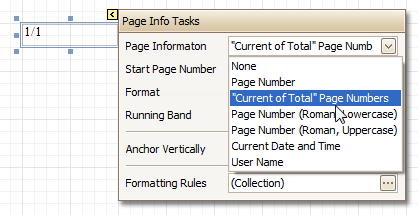
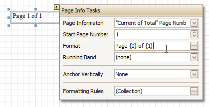
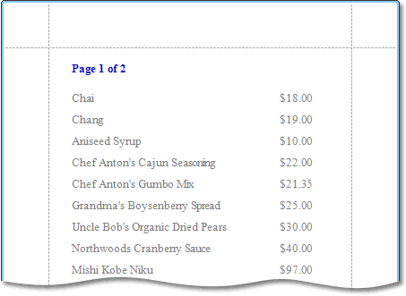
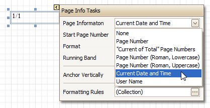
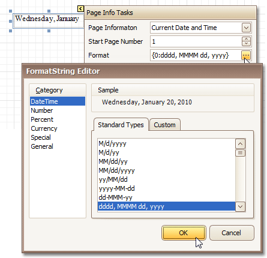
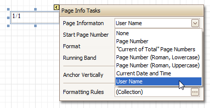
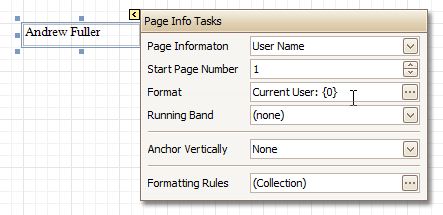
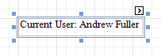

# Add Page Numbers and System Information to a Report
This document describes how to insert _page numbers_ or other system information (e.g. _current date and time_, _user name_, etc.) into a report.

Generally, this information is displayed within the [Page Header and Footer](../report-designer-reference/report-bands/page-header-and-footer.md) or [Page Margin](../report-designer-reference/report-bands/page-margin-bands.md) bands. To add page numbers or system information to a report, locate the [Control Toolbox](../report-designer-reference/report-designer-ui/control-toolbox.md) and drag and drop the [Page Info](../report-designer-reference/report-controls/page-info.md) control.

Then, follow the instructions below for your specific task.
* [Add Page Numbers](#pagenumbers)
* [Add System Date and Time](#datetime)
* [Add the User Name](#username)

## <a name="pagenumbers"/>Add Page Numbers
1. Select the **Page Info** control, click its [Smart Tag](../report-designer-reference/report-designer-ui/smart-tag.md), and in the invoked actions list, expand the drop-down list for the **Page Information** entry.
	
	
	
	Select whether to display only the page number (Latin or Roman - uppercase or lowercase), or the current page number with total pages.
2. To [format](change-value-formatting-of-report-elements.md) the control's text, via its Smart Tag, invoked its actions list, and specify the required format (e.g. **Page {0} of {1}**).
	
	
3. Using the control's actions list, you also can specify the _starting page number_, and the _running band_ (e.g. this option is available when there are [groups](change-or-apply-data-grouping-to-a-report.md) in a report, and it's required to apply independent page numbering for them). For details on this, refer to [Add Page Numbers for Groups](../create-reports/miscellaneous/add-page-numbers-for-groups.md).

The result is shown below.

## <a name="datetime"/>Add System Date and Time
1. Select the **Page Info** control, click its [Smart Tag](../report-designer-reference/report-designer-ui/smart-tag.md), and in the invoked actions list, expand the drop-down list for the **Page Information** entry, and select **Current Date and Time**.
	
	
2. To [format](change-value-formatting-of-report-elements.md) the control's text, via its Smart Tag, invoked its actions list, and specify the required format. You can either type it in the **Format** field, or, click its ellipsis button and use the **Format String Editor**.
	
	

The result is shown below.

## <a name="username"/>Add the User Name
1. Select the **Page Info** control, click its [Smart Tag](../report-designer-reference/report-designer-ui/smart-tag.md), and in the invoked actions list, expand the drop-down list for the **Page Information** entry, and select **User Name**.
	
	
2. To [format](change-value-formatting-of-report-elements.md) the control's text, via its Smart Tag, invoke its actions list, and specify the required format (e.g. **Current User: {0}**).
	
	

The result is shown below.

