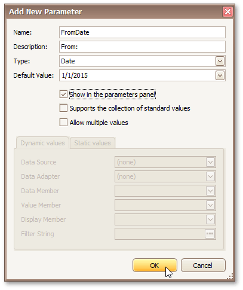
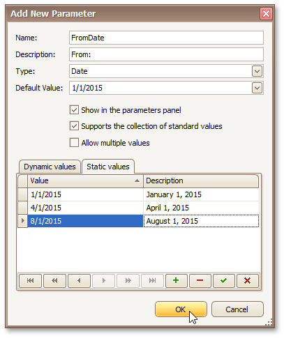
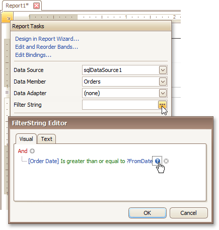
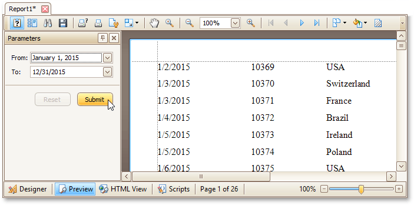
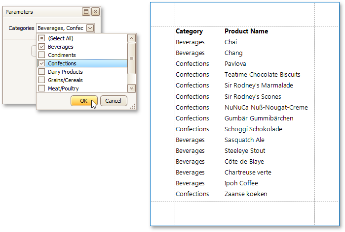

# Add Parameters to a Report
For your report, you can employ _parameters_, which can be requested each time the report is being previewed. Based on specified values, the report will then be [filtered](change-or-apply-data-filtering-to-a-report.md). It is also possible to employ parameters in expressions of [calculated fields](add-calculated-fields-to-a-report.md).

In this example, we'll create two date-time parameters to filter out orders that don't fall in the specified range from the report.

To add parameters and filter your report based on their values, follow the steps below.
1. In the [Field List](../report-designer-reference/report-designer-ui/field-list.md) window, right-click the **Parameters** section and in the invoked menu, click **Add Parameter**.
	
	
2. In the invoked window for the created parameter, set its **Name** and **Description**. And, make sure to set its **Type** to an appropriate value.
	
	
	
	> [!NOTE]
	> In Print Preview, the report's document is not generated until you have submitted values of all the parameters that have the **Show in the parameters panel** option switched on via the **Parameters** UI.
3. Enabling the **Supports the collection of standard values** option of the parameter allows end-users to modify its value and also activates the **Dynamic values** and the **Static values** tabs of the window:
	* On the **Dynamic values** tab, you can specify a parameter's data source, data adapter and data member. The value member defines a data field that provides values to the parameter. The display member defines a data field that provides display names for parameter values (how these values appear in the user interface available in a Print Preview).
	* On the **Static values** tab, you can manually fill the list of parameter values, with each value having an individual description (specifying how this value appears in the **Parameters** panel).
	
	
	
	Then, repeat the previous steps to create the second parameter, so that every time your report is previewed, you will be asked to specify two dates.
	
	The following instructions explain how to use parameters to filter your report's data.
4. Click your report's [Smart Tag](../report-designer-reference/report-designer-ui/smart-tag.md), and in the invoked actions list, click the ellipsis button for the **Filter String** property. Then, in the invoked **FilterString Editor**, construct an expression where a data field is compared with the created parameters. To access parameters, click the icon on the right until it turns into a question mark.
	
	
	
	The complete filtering expression will then look like this.
	
	

The Parametrized report is now ready. Switch to the [Preview Tab](../report-designer-reference/report-designer-ui/preview-tab.md), and in the **Parameters** section, define the required values and click **Submit**.

If a parameter is bound to a collection of standard values, it is possible to store more than one value in it. To do this, when creating a parameter using the **Add New Parameter** dialog, select the **Allow multiple values**.
 check box.

Multi-value parameters are useful when you need to filter report data against a list of values. The image below demonstrates a correct filleting expression that incorporates a multi-value parameter.

The following image shows an editor for a multi-value parameter in a print preview.

