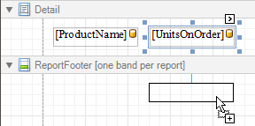

# Add Totals to a Report
With Report Designer, you can force a [data-bound control](displaying-values-from-a-database-(binding-report-elements-to-data).md) to calculate one of the standard summary functions (**Average**, **Sum**, **Count**, **Percentage**, **Max**, **Min**, etc.)

To calculate summaries (totals) within a report, follow the instructions below.
1. To display the result at the bottom of a report, the [Report Footer](../report-designer-reference/report-bands/report-header-and-footer.md) band should be present. To add it, right-click anywhere over the report's area and in the invoked [Context Menu](../report-designer-reference/report-designer-ui/context-menu.md), select **Insert Band** | **ReportFooter**.
	
	
2. Click the field for which a summary will be calculated, to select it. Then, hold down CTRL and drag the field onto the Report Footer area, to create an exact copy of the [Label](../create-reports/report-types/label-report.md) that will display the summary.
	
	
	
	> [!NOTE]
	> You can also create a new label for your total by simply dragging it from the [Control Toolbox](../report-designer-reference/report-designer-ui/control-toolbox.md).
3. Now, select the newly created Label, click its [Smart Tag](../report-designer-reference/report-designer-ui/smart-tag.md), and in its actions list, click the ellipsis button for the **Summary** item. And, in the invoked **Summary Editor**, specify the summary options.
	
	The following image shows an example of how you can set up your total. Note that the **Summary Running** option is set to **Report**, to ensure that all values from the specified data field are taken into account.
	
	
	
	> [!NOTE]
	> The **Ignore NULL values** option won't affect the result in this example, since NULL values are treated like zeros, by default. So, Sum won't change whether these values are taken into account or not. This option makes sense for functions like **Count** or **Average**, because the number of elements counted will depend on it.
	
	Note also that _value formatting_ is applied to a summary independently of the [general formatting](change-value-formatting-of-report-elements.md), and has a greater priority.
	
	When calculating totals for [groups](change-or-apply-data-grouping-to-a-report.md), you can [sort the groups against a summary function result](../create-reports/miscellaneous/sort-groups-by-a-summary-function-result.md).
	
	To save the settings and close the dialog, click **OK**.

Switch to the [Preview Tab](../report-designer-reference/report-designer-ui/preview-tab.md), and view the result.

