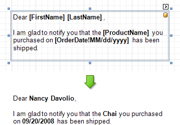

# Use Mail Merge in Report Elements
The _mail merge_ feature allows you to combine both [static](add-or-modify-static-information-in-your-report.md) and [dynamic](displaying-values-from-a-database-(binding-report-elements-to-data).md) content within the same [control](../report-designer-reference/report-controls.md) (e.g. to append some text prefix or postfix to a value obtained from a database), or even bind a control to multiple data fields at one time.

Mail merge is available for the following controls.
* [Bar Code](../report-designer-reference/report-controls/bar-code.md)
* [Check Box](../report-designer-reference/report-controls/check-box.md)
* [Label](../report-designer-reference/report-controls/label.md)
* [Rich Text](../report-designer-reference/report-controls/rich-text.md)
* [Table Cell](../report-designer-reference/report-controls/table-cell.md)
* [Zip Code](../report-designer-reference/report-controls/zip-code.md)

To embed dynamic data into a control's static content, type in data field names surrounded by **[**square brackets**]**.

To learn how _values formatting_ can be applied to the embedded data fields (e.g. for them to be treated as _currency_, or _date-time_ content), refer to [Change Value Formatting of Report Elements](change-value-formatting-of-report-elements.md).