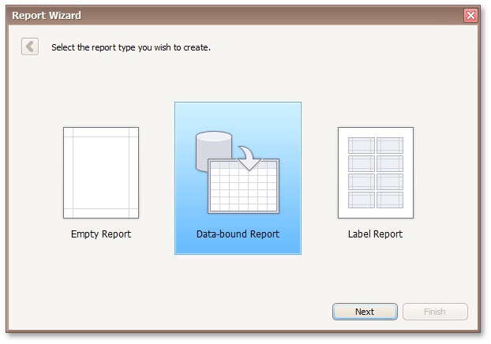

# Choose a Report Type
On this wizard page, you can choose which report to create.

The following report types are available.
* [Empty Report](empty-report.md)
	
	This option allows you to create a report that is not bound to data and does not contain any report controls.
* [Data-bound Report](data-bound-report.md)
	
	This option allows you to easily create a banded report displaying data in a tabular format. While setting up your report, you will be able to group data, add totals to your report, apply one of the predefined report styles, etc.
* [Label Report](label-report.md)
	
	Select this report type if you need to print out labels. In the Label Report Wizard, simply choose the required paper supplier and label type, and the report is adjusted automatically. After completing the wizard, you get an empty report that clearly indicates label boundaries and properly positions labels within paper sheets.