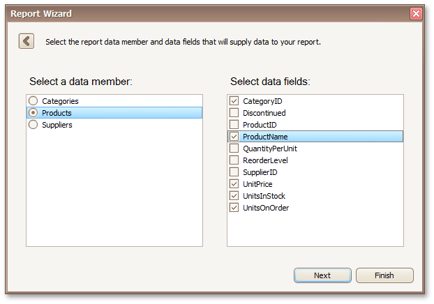
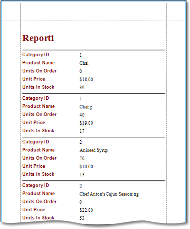

# Choose Columns to Display in Your Report
Depending on whether or not a report has been assigned a data member prior to running the wizard, the following pages are used at this step.
* **Data Source Wizard**
	
	If the report's **DataMember** property has not yet been specified, this wizard page allows you to select the queries that will be used as the report data member and choose fields from this query to use in your report.
	
	
* **Report Wizard**
	
	If the report's data member is already specified before running the wizard, this page allows you to choose the data fields from this data member to include into the report.
	
	

You can stop the wizard at this step by clicking **Finish**. The selected fields with corresponding captions will be automatically added to the created report and arranged one under another (in the order they are in the data source).

To continue report customization, select at least one field and click **Next** to proceed to the next wizard page: [Add Grouping Levels](add-grouping-levels.md).