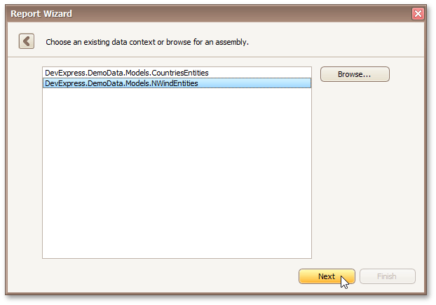

# Select the Data Context
> [!NOTE]
> This wizard step appears only if you're creating a new report from scratch. If you're modifying an existing report, this step will not appear and you will start with the [Choose Columns to Display in Your Report](../choose-columns-to-display-in-your-report.md) wizard page.

On this page, select the required data context from the list of available data contexts.

If the **Browse** button is available on this page, you can also select a data context from a custom assembly.

Click **Next** to proceed to the next wizard page: [Select the Connection String](select-the-connection-string.md).