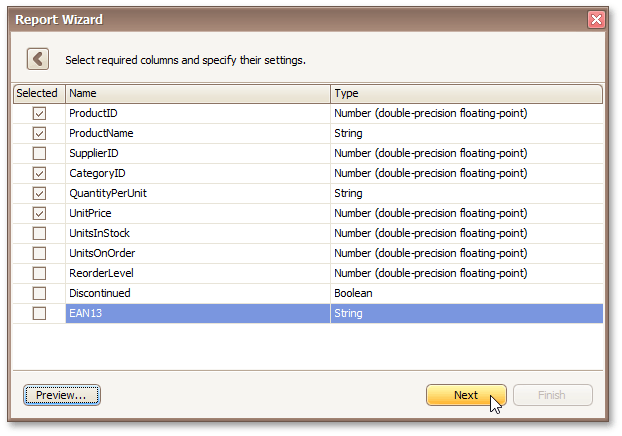
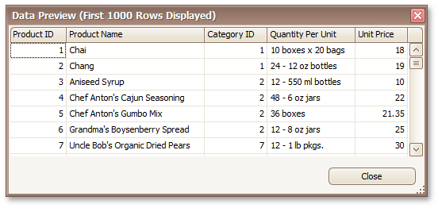

# Choose Columns
> [!NOTE]
> This wizard step appears only if you're creating a new report from scratch. If you're modifying an existing report, this step will not appear and you will start with [Choose Columns to Display in Your Report](../choose-columns-to-display-in-your-report.md) wizard page.

On this wizard page, you can select required columns and specify their settings.

To select a column, enable the corresponding **Selected** check box. Use **Name** to specify the custom column name and **Type** to choose the column type.

This page also allows you to preview resulting data by clicking the **Preview...** button.

Click **Next** to proceed to the next wizard page: [Choose Columns to Display in Your Report](../choose-columns-to-display-in-your-report.md).