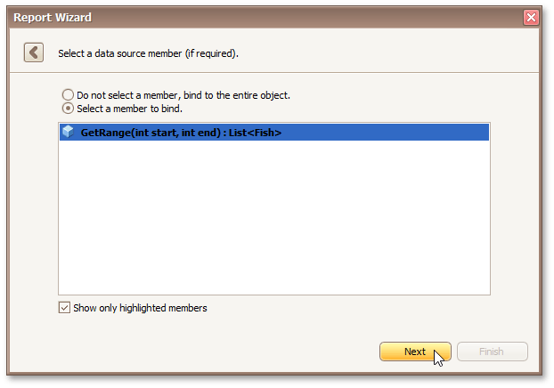

# Select a Data Source Member
> [!NOTE]
> This wizard step appears only if you're creating a new report from scratch. If you're modifying an existing report, this step will not appear and you will start with the [Choose Columns to Display in Your Report](../choose-columns-to-display-in-your-report.md) wizard page.

On this wizard page, specify whether you want to bind to the entire object or to its public member (method or property). To exclude irrelevant members from the list of available members, select the **Show only highlighted members** check box.

Click **Next** to proceed to the next wizard page depending on the selected option.
* [Specify the Member Parameters](specify-the-member-parameters.md)
* [Select the Data Binding Mode](select-the-data-binding-mode.md)