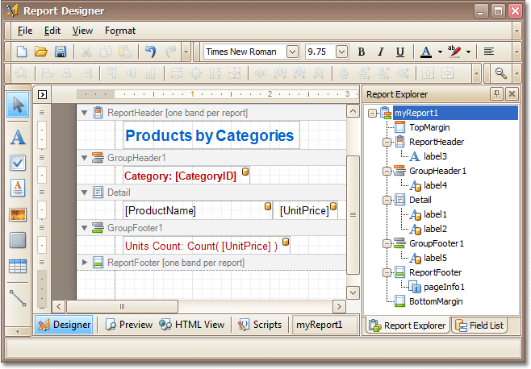

# Report Designer for WinForms
This guide contains information about the basic principles of creating reports with Report Designer.

The Report Designer allows you to create new reports from scratch, bind them to data, and even pass them to another workstation and load them into another instance of the report designer. In addition to report editing capabilities, it allows you to display its Print Preview and send its output to a printer or export it to a file on disk.

The following sections are available in this guide.
* [Report Editing Basics](report-designer-for-winforms/report-editing-basics.md)
* [Create Reports](report-designer-for-winforms/create-reports.md)
* [Report Designer Reference](report-designer-for-winforms/report-designer-reference.md)
* [Report Wizard](report-designer-for-winforms/report-wizard.md)
* [Preview, Print and Export Reports](report-designer-for-winforms/preview-print-and-export-reports.md)

> [!NOTE]
> Some features described in this guide may differ from what you see in your application. This depends on your application vendor.