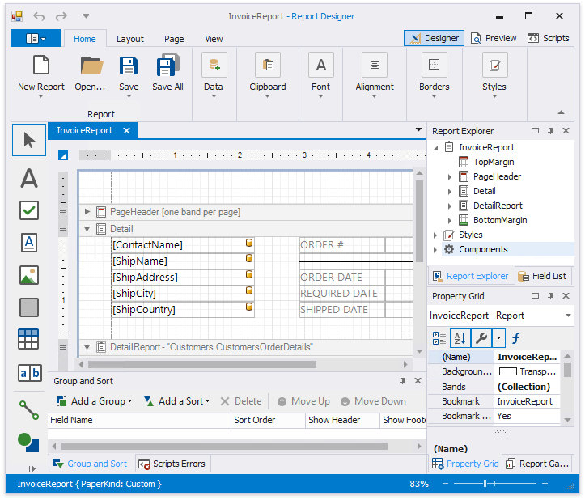

# Report Designer for WinForms

The Report Designer allows you to create data-bound reports and provides a rich set of tools to construct report layouts that meet your requirements. 

* [First Look at the Report Designer](report-designer-for-winforms/first-look-at-the-report-designer.md)
* [Add New Reports](report-designer-for-winforms/add-new-reports.md)
* [Open Reports](report-designer-for-winforms/open-reports.md)
* [Save Reports](report-designer-for-winforms/save-reports.md)
* [Introduction to Banded Reports](report-designer-for-winforms/introduction-to-banded-reports.md)
* [Bind to Data](report-designer-for-winforms/bind-to-data.md)
* [Create Popular Reports](report-designer-for-winforms/create-popular-reports.md)
* [Configure Design Settings](report-designer-for-winforms/configure-design-settings.md)
* [Use Report Elements](report-designer-for-winforms/use-report-elements.md)
* [Shape Report Data](report-designer-for-winforms/shape-report-data.md)
* [Lay out Dynamic Report Content](report-designer-for-winforms/lay-out-dynamic-report-content.md)
* [Customize Appearance](report-designer-for-winforms/customize-appearance.md)
* [Add Navigation](report-designer-for-winforms/add-navigation.md)
* [Provide Interactivity](report-designer-for-winforms/provide-interactivity.md)
* [Add Extra Information](report-designer-for-winforms/add-extra-information.md)
* [Use Expressions](report-designer-for-winforms/use-expressions.md)
* [Use Report Scripts](report-designer-for-winforms/use-report-scripts.md)
* [Report Designer Tools](report-designer-for-winforms/report-designer-tools.md)
* [Preview, Print and Export Reports](report-designer-for-winforms/preview-print-and-export-reports.md)

> [!NOTE]
> Specific features described in this guide may differ from what you see in your application. This depends on your application vendor.