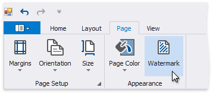
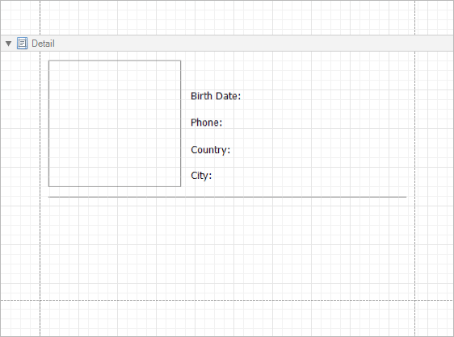
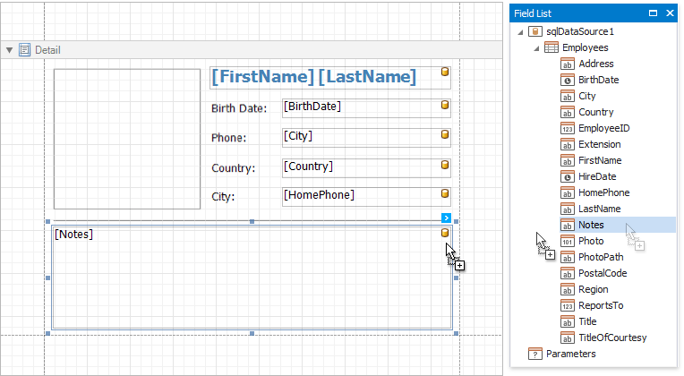

# Add Watermarks to a Report

This tutorial describes how to add watermarks to a report and use preprinted forms.

## Add a Watermark to a Report
To add a watermark to a report, do the following.

1. Switch to the [toolbar](..\report-designer-tools\toolbar.md)'s **Page** page and press **Watermark**.

	
	
2. In the invoked **Watermark** dialog, select either the **Text Watermark** or **Picture Watermark** tab, depending on the type of watermark you wish to add.
	
	For a text watermark, specify the text, direction and font options.
	
	
	
	For a picture watermark, you need to specify an image. To do this, click the ellipsis button for the **Load image** option.
	
	
	
	In the invoked **Select Picture** dialog, select the file containing the image that you wish to use as a watermark and click **Open**. Next, specify the size mode and alignment options for the picture.
	
	Additionally, for both textual and picture watermarks, you can adjust the transparency, position (in front of or behind the document content), and the page range in which the watermark will be printed.

## Supply a Preprinted Form
You can use a picture watermark as a template, to display an image of the preprinted form on the report's body at design time.

To display a watermark at design time, switch to the [toolbar](..\report-designer-tools\toolbar.md)'s **View** page and activate  **Watermark**.

The following image illustrates a report with a watermark shown at design-time that contains a template of a preprinted form.

Place report controls on the report's body according to the layout of the preprinted form.

