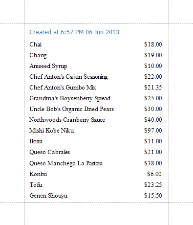
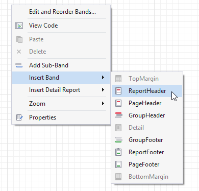
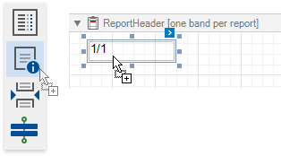
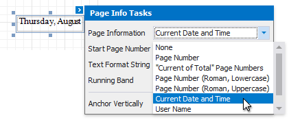
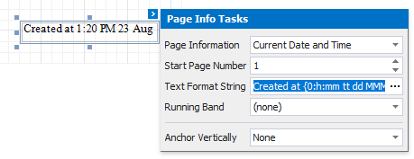

# Display the Current Date and Time in a Report

This tutorial demonstrates how to insert the current system date and time into a report using the [PageInfo](..\use-report-elements\use-basic-report-controls\page-info.md) control.

Do the following to include information about the current date and time into a report:

1. Typically, the current date and time are displayed within the [Report Header](..\introduction-to-banded-reports.md) band. To add it to the report, right click anywhere on the report's surface. In the invoked menu, point to **Insert Band** and click **ReportHeader**.
	
	
2. Drop the [PageInfo](..\use-report-elements\use-basic-report-controls\page-info.md) control from the [Toolbox](..\report-designer-tools\toolbox.md) onto the **ReportHeader** band.
	
	
3. Set the control's **PageInformation** property to *DateTime* (e.g. using the smart tag).
	
	
4. To apply a format string to the control's contents, type **Created at {0:h:mm tt dd MMMM yyyy}** into its **TextFormatString** property.
	
	