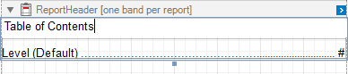
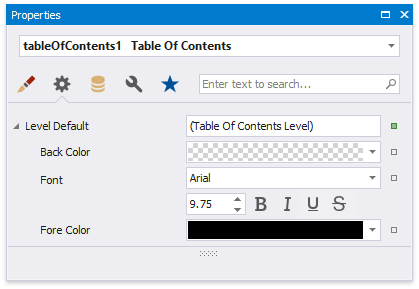
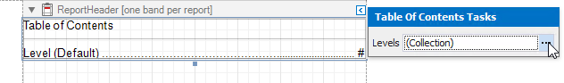

# Create a Table of Contents
This tutorial describes the steps to create a report with a table of contents. A table of contents is automatically created based on the [bookmarks](add-bookmarks-and-a-document-map.md) existing in a report.

To create a table of contents in a report, do the following.
1. From the [Control Toolbox](..\report-designer-tools\toolbox.md), drop the [Table of Contents](..\use-report-elements\use-basic-report-controls\table-of-contents.md) control onto the [Report Header band](..\introduction-to-banded-reports.md).
	
	
2. Double-click the title of the table of contents and specify its text.
	
	
3. To customize the title appearance, use the **Level Title** option's settings available in the **Properties** window.
	
	
4. To customize the appearance of all other levels, use the **Level Default** option's settings.
	
	
5. To customize a specific level individually, add a corresponding item to the **Levels** collection of the table of contents and customize its properties.
	
	
	
	

The following image demonstrates the result in Print Preview:

