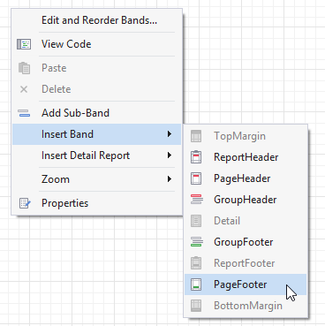
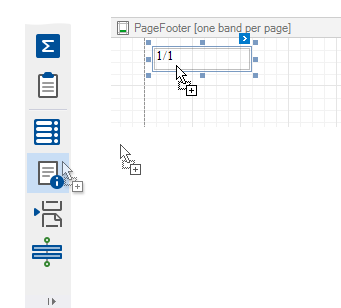
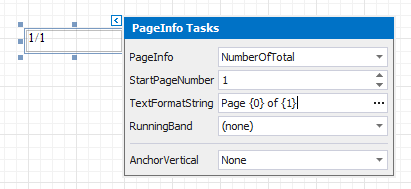
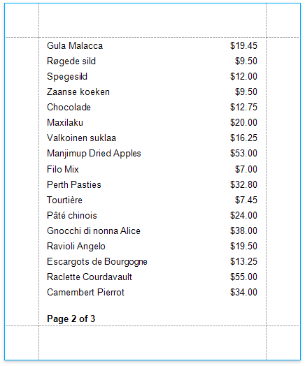
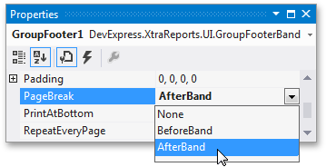
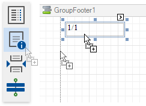
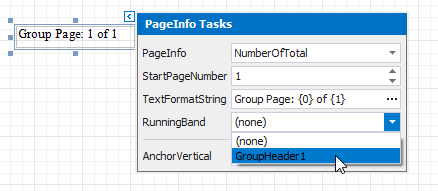
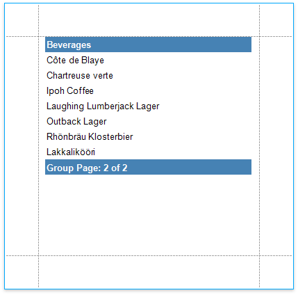

# Add Page Numbers

The tutorial describes how to add page numbers to your reports.

## Add Page Numbers
Do the following to add page numbers to a report:

- Create a [PageFooterBand](..\introduction-to-banded-reports.md) in your report. To do this, right-click anywhere in the report designer, and in the context menu point to **Insert Band**, and then click **PageFooter**.
	
	
- Drop the [PageInfo](..\use-report-elements\use-basic-report-controls\page-info.md) control from the [Toolbox](..\report-designer-tools\toolbox.md) to the **PageFooter** band.
	
	
- To change the control's display format, click its smart tag, and in the invoked actions list, specify the **TextFormatString** property (e.g., **Page {0} of {1}**, to display the current page number out of the total number of pages).
	
	

The following image illustrates the resulting report:

## Add Page Numbers for Groups
Do the following to make your report display page numbers for groups or detail reports:

- Add the **GroupFooter** band. To do this, right-click anywhere on the report's surface, and in the invoked menu, point to **Insert Band** and click **GroupFooter**.
	
	
	
	> [!NOTE]
	> You can force the group header and/or the group footer to be repeated on each page, using the GroupBand's **RepeatEveryPage** property.
- Next, force each new group to start on a separate page. Otherwise, group page numbers will be calculated incorrectly.
	
	To do this, select the Group Footer, and set its **PageBreak** property to *AfterBand*.
	
	
- Drop the [PageInfo](..\use-report-elements\use-basic-report-controls\page-info.md) control from the [Toolbox](..\report-designer-tools\toolbox.md) onto the **GroupFooter** (or **GroupHeader**) band.
	
	
- Select the created control, and set its **RunningBand** property to *GroupHeader1*.
	
	
	
	> [!TIP]
	> You can use the **TextFormatString** and **PageInfo** properties to adjust the way the control represents its contents.

The following image illustrates the resulting report:

