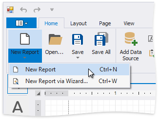
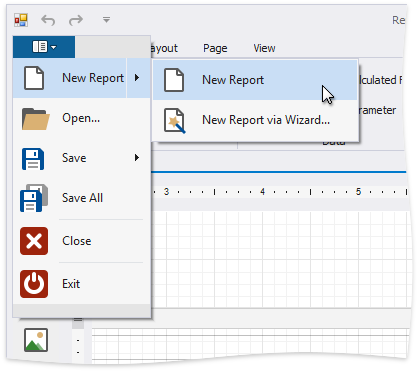
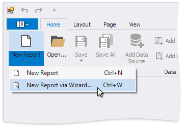
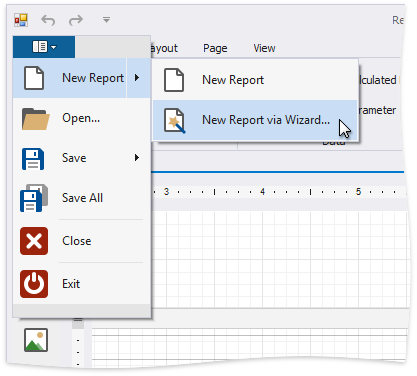

# Add New Reports

This topic explains how to create a new report in the Report Designer.

> [!Tip]
> Before you start, make sure to [back up the current report](save-reports.md).

## Create a New Blank Report

You can use one of the following commands to create a new report. The created report contains three [bands](introduction-to-banded-reports.md) - **Page Header**, **Detail**, and **Page Footer**. Refer to the [Use Report Elements](use-report-elements.md) section for information on how to add controls to the report.

### Use the Ribbon's Home Tab

Click **New Report**.

### Use the Ribbon Application Menu

Click the application button and then **New Report**.

### Use a Shortcut

You can also use the CTRL+N shortcut to create a new report.

## Create a New Report Using the Report Wizard

The following commands run the [Report Wizard](report-designer-tools\report-wizard.md). Go through the wizard's pages to get a predesigned report.

### Use the Ribbon's Home Tab

Click **New Report** and then **New Report via Wizard...**.

### Use the Ribbon Application Menu

Click the application button and then choose **New Report** | **New Report via Wizard...**.

### Use a Shortcut

You can also use the CTRL+W shortcut to run the [Report Wizard](report-designer-tools\report-wizard.md).
