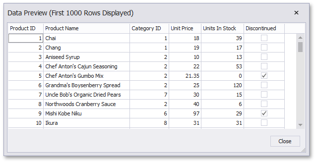

# Bind a Report to a CSV File

This tutorial describes how to bind a report to data obtained from a CSV file:

1. [Create a new report](../add-new-reports.md).
2. Click the report's smart tag. In the invoked actions list, expand the drop-down menu for the **Data Source** property and click **Add Report DataSource**.
	
	

3. On the first page of the invoked [Data Source Wizard](../report-designer-tools/data-source-wizard.md), select **Excel File** and click **Next**.
	
	

4. On the next wizard page, click the ellipsis button and locate the required CSV file or enter the full path to the file.
	
	
	
	Click **Next** to proceed to the next wizard page.

5. The next wizard page allows you to specify the import settings.
	
	Enable the first check box to use values of the first row as field names. If you disable this option, values of the first row will be imported as data and field names will be generated automatically. The **Skip empty rows** option specifies whether to include empty rows to the result data source.
	
	This page also provides the **Encoding**, **Newline type** and **Value separator** settings that specify the character encoding, the line break type and a character used to separate values in the CSV document. To automatically determine values of these settings, enable the corresponding **Detect automatically** check boxes. You can also disable these check boxes and manually choose desired values in the drop-down lists.
	
	Use the **Culture** option to specify the culture information. The **Text Qualifier** setting allows you to select the character that encloses values in the source file.
	
	Enable the **Trim Blanks** check box to delete all leading and trailing empty spaces from each value in the CSV file.
	
	
	
	Specify required settings and click **Next**.
5. The next page allows you to select required columns and specify their settings.
	
	To include a column to the result data source, enable the corresponding **Selected** check box. Use **Name** to specify the custom column name and **Type** to choose the column type.
	
	
	
	On this page, you can also preview the result data by clicking the **Preview** button.
	
	
	
	Click **Finish** to complete the wizard.

The created data source becomes displayed in the [Report Explorer](../report-designer-tools/ui-panels/report-explorer.md)'s **Components** node. The [Field List](../report-designer-tools/ui-panels/field-list.md) reflects the data source's hierarchy.

