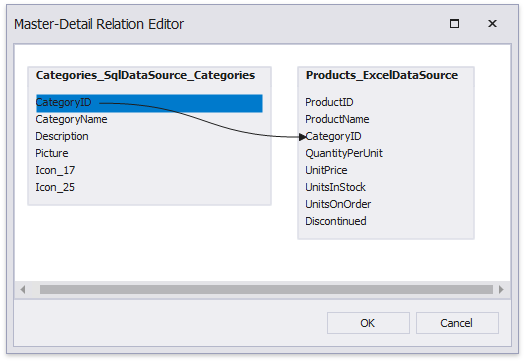
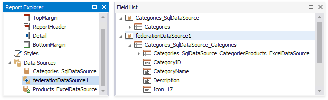

# Bind a Report to a Federated Master-Detail Data Source

This topic describes how to create a federated data source that retrieves data from multiple data sources. The topic also shows how to specify a master-detail relationship between these queries.

## Create a Report and Data Sources

1. [Create a new blank report](../../../../articles/report-designer/report-designer-for-winforms/report-designer-tools/report-wizard/blank-report.md).

2. [Add a SQL data source](../../../../articles/report-designer/report-designer-for-winforms/bind-to-data/bind-a-report-to-a-database.md) that provides one data table.

3. [Add an Excel data source](../../../../articles/report-designer/report-designer-for-winforms/bind-to-data/bind-a-report-to-an-excel-workbook.md) that provides the other data table.

    

## Create Data Federation and Bind the Report to It

1. Click the report's smart tag, expand the **Data Source** property's drop-down menu, and click **Add New DataSource**.

    

2. In the invoked [Data Source Wizard](../../../../articles/report-designer/report-designer-for-winforms/report-designer-tools/data-source-wizard.md), select **Data Federation** and click **Next**.

    

3. On the next page, enable check boxes for the SQL data source's table and the Excel data source. The selected items are included in data federation as separate queries.

    Click **Manage Relations** to specify a master-detail relationship between these queries.

    

4. In the invoked editor, drag and drop the key field from the master query to the detail query.

    

5. Click **OK** to close the editor. Click **Finish** to complete the Data Source Wizard.

The Data Source Wizard creates a new **FederationDataSource** that includes two queries with a master-detail relationship. This data source becomes available in the [Report Explorer](../../../../articles/report-designer/report-designer-for-winforms/report-designer-tools/ui-panels/report-explorer.md)'s **Components** node. The [Field List](../../../../articles/report-designer/report-designer-for-winforms/report-designer-tools/ui-panels/field-list.md) reflects the data source's structure.

The Data Source Wizard specifies query names as follows:

* If the initial data source contains data at the root level (as the Excel data source), the federated query's name equals to the data source name.
* If the initial data source contains one or more queries (as the SQL data source), the federated query's name consists of the data source name and query name separated by an underscore.

You can rename queries in the **Manage Queries** dialog. To invoke it, right-click the data source in the Field List or Report Explorer and select **Manage Queries** in the context menu.

The master-detail relationship's name changes accordingly.

Once you rename the query, update the report's **Data Member** property.

## Design the Report Layout

1. Click the report's smart tag and select **Design in Report Wizard**.

    

2. In the invoked [Report Wizard](../../../../articles/report-designer/report-designer-for-winforms/report-designer-tools/report-wizard.md), select **Table Report** and click **Next**.

    

3. Select data members for the report and its [detail reports](../../../../articles/report-designer/report-designer-for-winforms/create-reports/master-detail-reports-with-detail-report-bands.md). Select data fields to display in the report and click **Finish**. You can also go to the [next page](../../../../articles/report-designer/report-designer-for-winforms/report-designer-tools/report-wizard/table-report/add-grouping-levels.md) to continue layout creation.

    

The resulting layout looks similar to the following image:

Switch to the Preview mode to see the report document.

