# Bind a Report to a Join-Based Federated Data Source

This topic describes how to create a federated data source that joins data from multiple data sources into a single query.

## Create a Report and Data Sources

1. [Create a new blank report](../../../../articles/report-designer/report-designer-for-winforms/report-designer-tools/report-wizard/blank-report.md).

2. [Add a SQL data source](../../../../articles/report-designer/report-designer-for-winforms/bind-to-data/bind-a-report-to-a-database.md) that provides one data table.

3. [Add an Excel data source](../../../../articles/report-designer/report-designer-for-winforms/bind-to-data/bind-a-report-to-an-excel-workbook.md) that provides the other data table.

    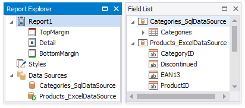

## Create Data Federation and Bind the Report to It

1. Click the report's smart tag, expand the **Data Source** property's drop-down menu, and click **Add New DataSource**.

    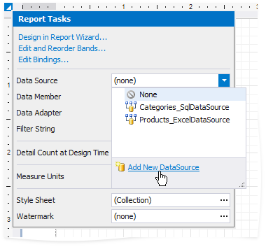

2. In the invoked [Data Source Wizard](../../../../articles/report-designer/report-designer-for-winforms/report-designer-tools/data-source-wizard.md), select **Data Federation** and click **Next**.

    

3. On the next page, click **Add Query**.

    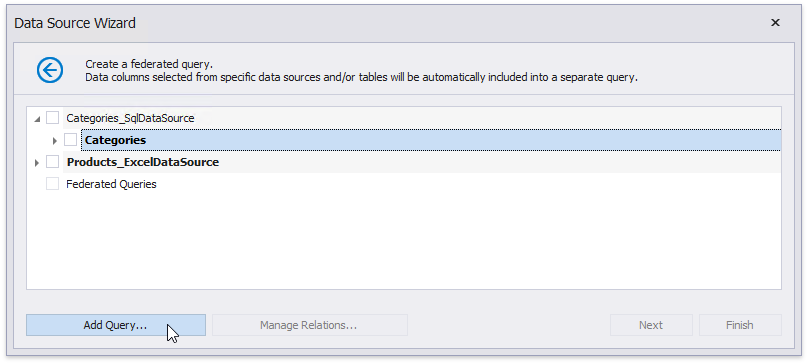

4. In the invoked [Query Builder](../../../../articles/report-designer/report-designer-for-winforms/report-designer-tools/query-builder.md), drag and drop the table from the SQL data source onto the design surface.

    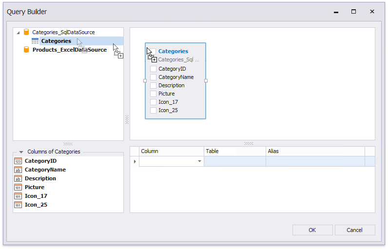

5. Drag and drop the Excel data source onto the design surface. In the invoked **Join Editor**, select the **Inner join** type and create a relationship based on the key field.

    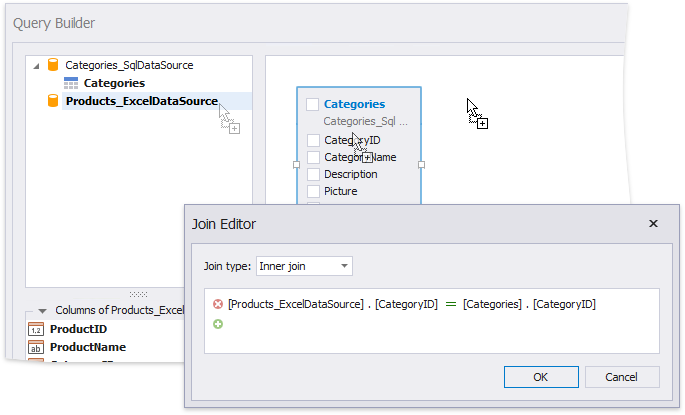

6. Enable checkboxes for the data fields you want to include in the query result set.

    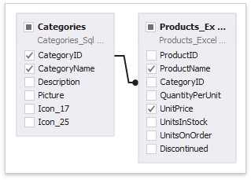

    You can specify a different name for a field. Click the field's **Alias** cell and type the alias.

    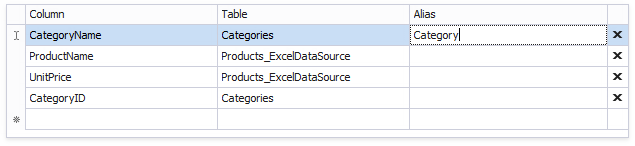

    Use the grid's empty line to add an unbound field to a query. Click the field's ellipsis button to invoke the [Expression Editor](../use-expressions.md) and construct an expression that specifies the field's value.

    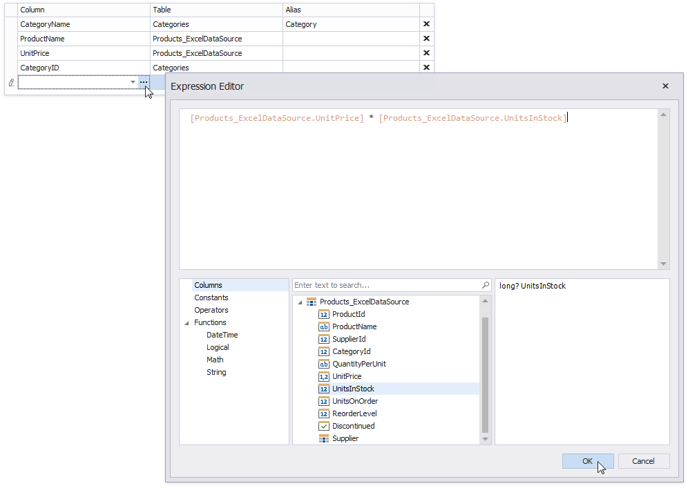

7. Click **OK** to close the Query Builder. Click **Finish** to complete the Data Source Wizard.
 
The Wizard creates a new **FederationDataSource** that includes the single query. This data source becomes available in the [Report Explorer](../../../../articles/report-designer/report-designer-for-winforms/report-designer-tools/ui-panels/report-explorer.md)'s **Components** node. The [Field List](../../../../articles/report-designer/report-designer-for-winforms/report-designer-tools/ui-panels/field-list.md) reflects the data source structure.

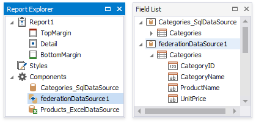

The federated query's default name is the same as the main table's name. To rename this query, right-click the data source in the Field List or Report Explorer and select **Manage Queries** in the context menu.

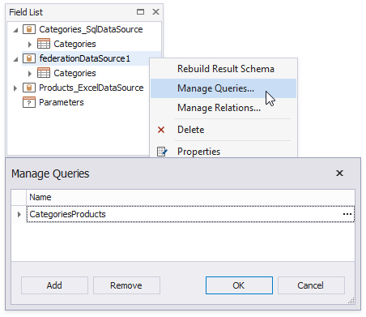

Once you rename the query, update the report's **Data Member** property.

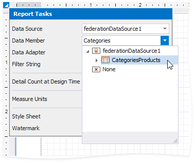

## Design the Report Layout

1. Click the report's smart tag and select **Design in Report Wizard**.

    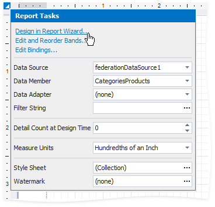

2. In the invoked [Report Wizard](../../../../articles/report-designer/report-designer-for-winforms/report-designer-tools/report-wizard.md), select **Table Report** and click **Next**.

    

3. Select data fields to display in the report and click **Finish**. You can also go to the [next page](../../../../articles/report-designer/report-designer-for-winforms/report-designer-tools/report-wizard/table-report/add-grouping-levels.md) to create the layout.

    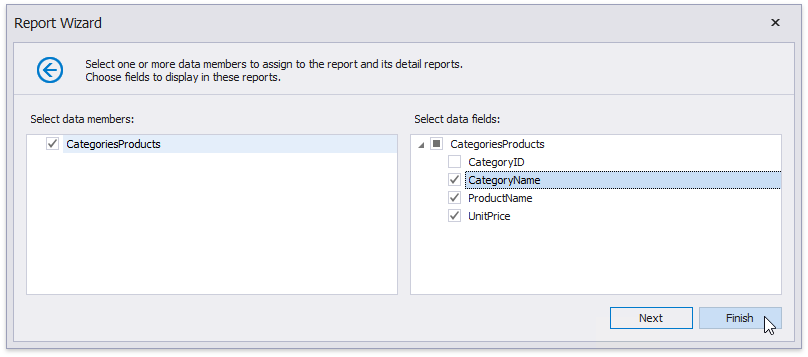

The resulting layout looks similar to the following image:

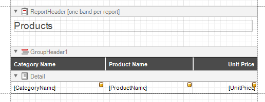

Switch to the Preview mode to see the report document.

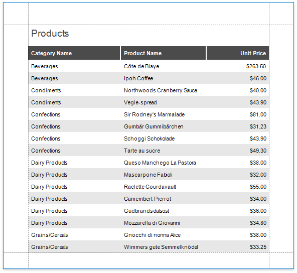
