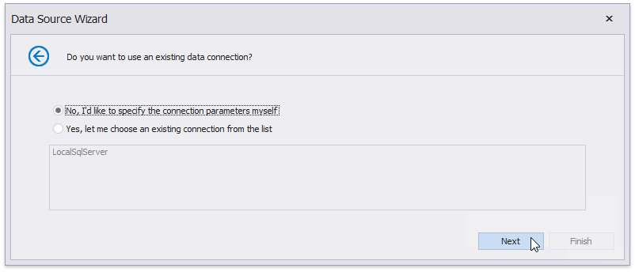
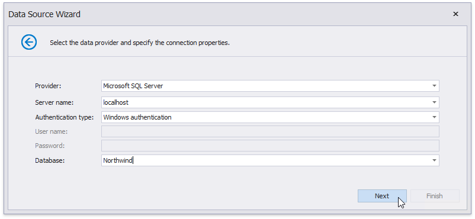

# Bind a Report to a Stored Procedure

This tutorial demonstrates how to bind a report to a stored procedure provided by an SQL data source:

1. [Create a new report](../add-new-reports.md).
2. Click the report's smart tag. In the invoked actions list, expand the drop-down menu for the **Data Source** property and click **Add Report DataSource**.
	
	
	
3. On the first page of the invoked [Data Source Wizard](../report-designer-tools/data-source-wizard.md), select **Database** and click **Next**.
	
	

4. The next page allows you to specify whether you want to use an existing data connection or create a new data connection with custom parameters. Select the first option to create a new connection and click **Next**.
	
	

5. On the next page, you can define a custom connection string or select from the list of [supported data providers](..\report-designer-tools\report-wizard\data-bound-report\connect-to-a-database\specify-a-connection-string.md). Depending on the data provider selected, it may be necessary to specify additional connection options (such as authentication type and database name) on this page.
	
	
	
	To proceed to the next wizard page, click **Next**.
6. On the next page, you can choose which tables, views and/or stored procedures to add to the report. Expand the **Stored Procedures** category, select the required stored procedure from the list of available stored procedures and click **Next**.
	
	
7. Then, the wizard generates query parameters for each stored procedure parameter. The next wizard page presents the generated query parameters. You can assign a static value or an expression to a parameter. In addition, you can map a report parameter to a query parameter. This is helpful when end users specify parameter values in the report's Preview. For details on how to configure query parameters, refer to the [Use Query Parameters](../shape-report-data/use-report-parameters/use-query-parameters.md) topic.
	
	Click the **Preview** button and select a query to preview the result of the stored procedure execution with the specified parameters.
	
	
	
	The following image demonstrates the **Data Preview** displaying the resulting data sample. Click **Close** to exit the preview.
	
	
	
	Click **Finish** to exit the wizard.