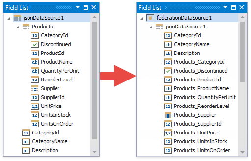
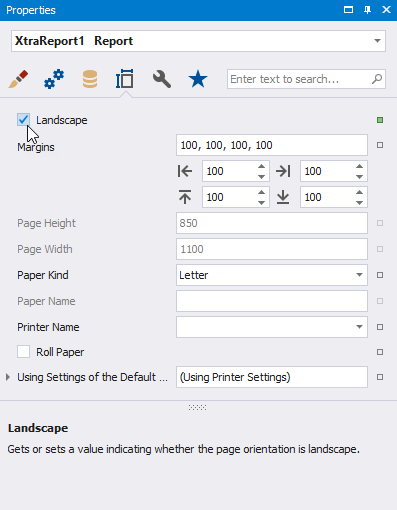
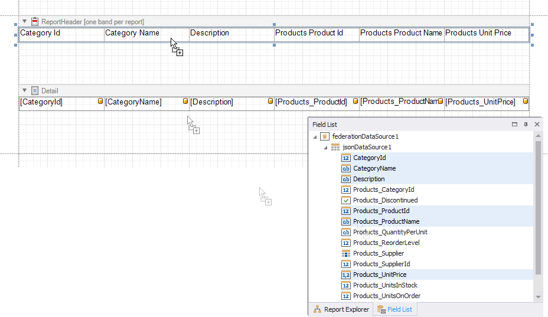
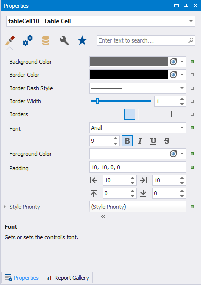
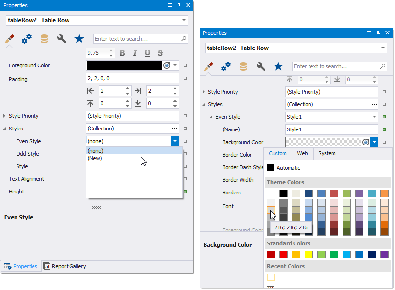

# Bind a Report to a Transformation-Based Data Source

If you bind a report to a [JSON](bind-a-report-to-json-data.md), [Object](bind-a-report-to-an-object-data-source.md), [Entity Framework](bind-a-report-to-an-entity-framework-data-source.md), or [XPO](bind-a-report-to-an-xpo-persistent-object.md) data source that contains a collection property, you can flatten the data source structure:



This tutorial illustrates how to use the **Federation Data Source**'s **Transformation** mode to flatten a JSON Data Source that contains a collection property.

## Create a Report and Bind it to a Data Source

1. [Create a new blank report](../add-new-reports.md)

2. [Add a JSON data source](bind-a-report-to-json-data.md)

	This tutorial uses the following JSON string:

    ```
    [
    {
        "CategoryId": 1,
        "CategoryName": "Beverages",
        "Description": "Soft drinks, coffees, teas, beers, and ales",
        "Products": [
        {
            "ProductId": 1,
            "ProductName": "Chai",
            "SupplierId": 1,
            "CategoryId": 1,
            "QuantityPerUnit": "10 boxes x 20 bags",
            "UnitPrice": 18.0000,
            "UnitsInStock": 39,
            "UnitsOnOrder": 0,
            "ReorderLevel": 10,
            "Discontinued": false,
            "Supplier": null
        },
        {
            "ProductId": 2,
            "ProductName": "Chang",
            "SupplierId": 1,
            "CategoryId": 1,
            "QuantityPerUnit": "24 - 12 oz bottles",
            "UnitPrice": 19.0000,
            "UnitsInStock": 17,
            "UnitsOnOrder": 40,
            "ReorderLevel": 25,
            "Discontinued": false,
            "Supplier": null
        }
        ]
    },
    {
        "CategoryId": 2,
        "CategoryName": "Condiments",
        "Description": "Sweet and savory sauces, relishes, spreads, and seasonings",
        "Products": [
        {
            "ProductId": 3,
            "ProductName": "Aniseed Syrup",
            "SupplierId": 1,
            "CategoryId": 2,
            "QuantityPerUnit": "12 - 550 ml bottles",
            "UnitPrice": 10.0000,
            "UnitsInStock": 13,
            "UnitsOnOrder": 70,
            "ReorderLevel": 25,
            "Discontinued": false,
            "Supplier": null
        },
        {
            "ProductId": 4,
            "ProductName": "Chef Anton's Cajun Seasoning",
            "SupplierId": 2,
            "CategoryId": 2,
            "QuantityPerUnit": "48 - 6 oz jars",
            "UnitPrice": 22.0000,
            "UnitsInStock": 53,
            "UnitsOnOrder": 0,
            "ReorderLevel": 0,
            "Discontinued": false,
            "Supplier": null
        }
        ]
    }
    ]
    ```

The [Field List](../report-designer-tools/ui-panels/field-list.md) displays the created JSON data source.


## Create Data Federation and Transform the Data Source

1. Click the report's smart tag, expand the **DataSource** property's drop-down menu, and click **Add Report Data Source**.

    

2. In the invoked **Data Source Wizard**, select **Data Federation** and click **Next**.

    

3. On the next page, click **Add Query**.

    

4. In the invoked [Query Builder](../report-designer-tools/query-builder.md), select the **Transformation** query type. Select the data source or query that contains columns you want to transform. Select the **Transform** check box next to the column you need to unfold and flatten. The bottom pane allows you to specify the aliases for the generated columns.

    

    Click **OK** to create the query and click **Finish** to create the data source.

The **Field List** displays the created Federation Data Source.


## Prepare the Report Layout

1. Set the **Landscape** orientation for report pages. Select the report and switch to the **Properties** panel. Enable the **Landscape** property.

    

2. Drop data fields from the **Field List** onto the report's [Detail](../introduction-to-banded-reports.md) band. Hold CTRL or SHIFT and click the fields to select multiple fields.

    

3. Add a **ReportHeader** band to the report. Right-click the report and select **Insert Band** / **ReportHeader**.

    

4. Create headers for the report columns. Select data fields and drop them onto the added **ReportHeader** band with the right mouse button.

    

5. Change header titles as necessary. Double-click a cell and type the new title.

    

6. Resize report columns. Select cells and drag their edges.

    

7. Change the header cells' appearance. Select cells and specify the following properties:

    | Property | Value |
    | --- | --- |
    | **Foreground Color** | White |
    | **Background Color** | DimGray |
    | **Padding** | 10, 10, 0, 0 |
    | **Font** | Arial, 9pt, style=Bold |

    

8. Change the band heights to match the table rows. Select the bands and drag their edges the same way as for the table cells.

9. Add a style for the table's even rows. Select **TableRow2** in the **Properties** window, expand the **Styles** property, and select **New** for the **Even Style** property. Then select **Style1** and set the **Background Color** property to **216, 216, 216**.

    

10. Format the price values. Select the cell that displays the **Products_UnitPrice** value and set its [Format String] to **{0:c2}**.

    

The report is ready. Upper-level data source records are repeated as many times as there are flattened records:

