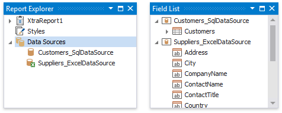
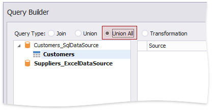
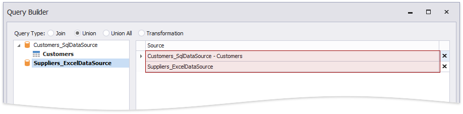

# Bind a Report to Union-Based Federated Data Source

You can create a federated data source for your report to display data combined from several sources. This topic demonstrates how to use the **Union** and **UnionAll** operations to combine data into a single query.

## Create a Report and Data Sources

1. [Create a new blank report](../../../../articles/report-designer/report-designer-for-winforms/report-designer-tools/report-wizard/blank-report.md).

2. [Add a SQL data source](../../../../articles/report-designer/report-designer-for-winforms/bind-to-data/bind-a-report-to-a-database.md) that provides one data table.

3. [Add an Excel data source](../../../../articles/report-designer/report-designer-for-winforms/bind-to-data/bind-a-report-to-an-excel-workbook.md) that provides the other data table.

    

## Create Data Federation and Bind the Report to It

1. Click the report's smart tag, expand the **DataSource** property's drop-down menu and click **Add Report Data Source**.

    

2. In the invoked [Data Source Wizard](../../../../articles/report-designer/report-designer-for-winforms/report-designer-tools/data-source-wizard.md), select **Data Federation** and click **Next**.

    

3. On the next page, click **Add Query**.

    

4. In the invoked [Query Builder](../../../../articles/report-designer/report-designer-for-winforms/report-designer-tools/query-builder.md) (adapted to federated data sources), choose **Union** as a query type.

    

    Or you can choose **Union All**.

    

5. Double-click the **Customers** table and the **Excel data source**. The two sources are added to the query.

    

    The query includes only fields that have identical names and types in the origin sources.

    <!--image-->
    

6. Rename fields.

    <!--image-->
    

7. Click **OK** to close the Query Builder. Click **Finish** to complete the Data Source Wizard.
 
The Wizard creates a new **FederationDataSource** that includes the single **Customers** query. This data source becomes available in the [Report Explorer](../../../../articles/report-designer/report-designer-for-winforms/report-designer-tools/ui-panels/report-explorer.md)'s **Components** node. The [Field List](../../../../articles/report-designer/report-designer-for-winforms/report-designer-tools/ui-panels/field-list.md) reflects the data source structure. 

The federated query's default name equals to the first source's name (the **Customers** table in this tutorial). You can rename this query in the **Manage Queries** dialog. To invoke it, right-click the data source in the Field List or Report Explorer and select **Manage Queries** in the context menu.

Once you rename the query, update the report's **DataMember** property.

## Design the Report Layout

1. Click the report's smart tag and select **Design in Report Wizard**.

    

2. In the invoked [Report Wizard](../../../../articles/report-designer/report-designer-for-winforms/report-designer-tools/report-wizard.md), select **Table Report** and click **Next**.

    

3. Select data fields to display in the report and click **Finish**. You can also go to the [next page](../../../../articles/report-designer/report-designer-for-winforms/report-designer-tools/report-wizard/table-report/add-grouping-levels.md) to continue layout creation.

    

The resulting layout looks similar to the following image:

Switch to the Preview tab to see the report document. It displays contacts from the Customers and Suppliers tables.

> [!Note]
> Duplicate contacts from the Customers and Suppliers tables are not removed in the **Union All** mode.