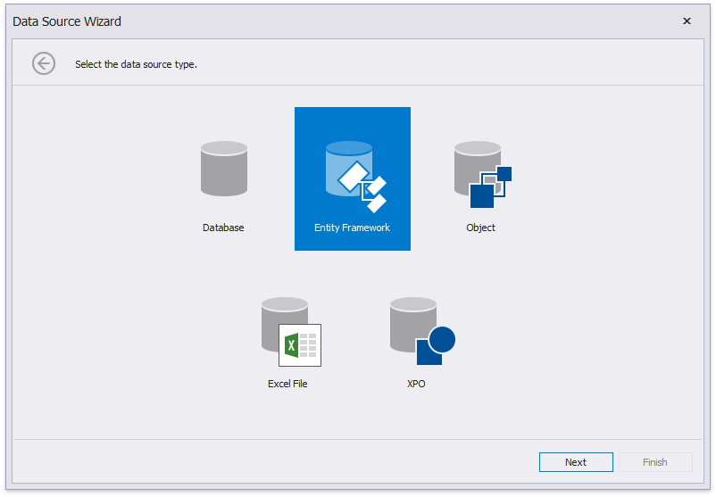
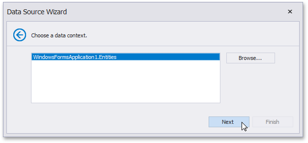
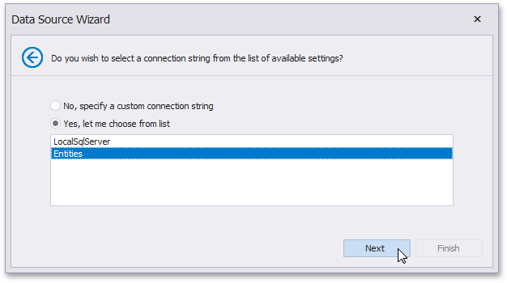
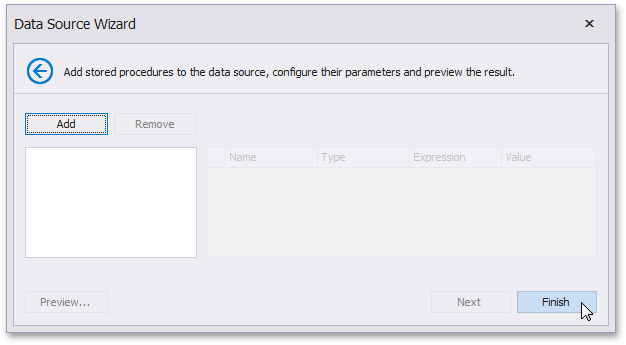
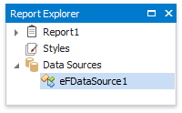

# Bind a Report to an Entity Framework Data Source

This document describes how to use an Entity Framework data source to bind a report to data provided by an Entity Framework data context:

1. [Create a new report](../add-new-reports.md).

2. Click the report's smart tag. In the invoked actions list, expand the drop-down menu for the **Data Source** property and click **Add Report DataSource**.
	
	

2. On the first page of the invoked [Data Source Wizard](../report-designer-tools/data-source-wizard.md), select the **Entity Framework** and click **Next**.
	
	

3. On the next page, select the required data context. You can bind it to an Entity Framework data context that is contained in either the current project assembly or a separate assembly.
	
	To use a data context that exists in the current project assembly, select it in the **Choose Context** list and click **Next**.
	
	
	
	Select the required data context and click **Next**.
4. On the next page, specify a connection string to be used to establish a data connection using one of the following two options.
	
	* Use an existing connection string available in the current project. To do this, select **Yes, let me choose from the list**. Next, select the required connection string from the list of the available connection strings.
		
		

	* Specify a connection string manually. To do this, select **No, specify a custom connection string** and click **Next**. On the next page, specify a connection string. You can choose to use the default connection string  or specify a custom connection string.
		
		

5. The next wizard page is available only if the current entity data model contains stored procedures. This page allows you to add stored procedures to the data source and configure their parameters. Click **Finish** to exit the wizard.
	
	
	
The newly created data source will be displayed in the **Components** node of the [Report Explorer](../report-designer-tools/ui-panels/report-explorer.md). Additionally, the hierarchy of the data source will be reflected by the [Field List](../report-designer-tools/ui-panels/field-list.md).
	
