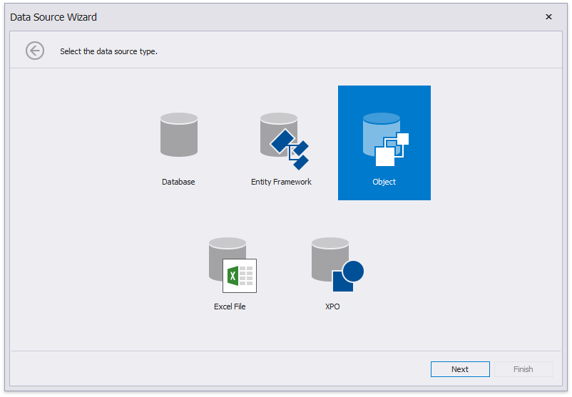
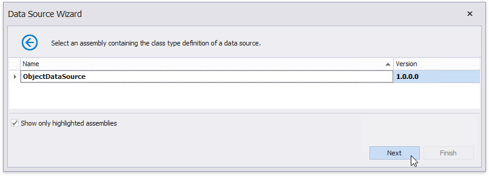

# Bind a Report to an Object Data Source

This tutorial describes how to bind a report to an object data source:

1. [Create a new report](../add-new-reports.md).
2. Click the report's smart tag. In the invoked actions list, expand the drop-down menu for the **Data Source** property and click **Add Report DataSource**.
	
	

3. On the next wizard page, choose the **Object Binding** option and click **Next**.
	
	

4. The following wizard page allows you to select an assembly that contains the data source's class type definition. Use the **Show only highlighted assemblies** checkbox to exclude irrelevant assemblies from this list.
	
	

5. On the next wizard page, select a data source type. Enable the **Show only highlighted types** checkbox to hide irrelevant classes from this list.
	
	

6. The next wizard page enables you to select whether to obtain the data source schema (enabling you to edit the report layout without having access to the actual underlying data) or retrieve the actual data from the data source. Choose the second option and click **Next**.
	
	

7. On the following wizard page, select a data source constructor and click **Next**. Use the **Show only highlighted constructors** checkbox to exclude irrelevant constructors from this list.
	
	

8. The next wizard page allows you to specify the constructor parameters.
	
	Enabling the checkbox in the **Expression** column allows you to specify the parameter expression (using the **Expression Editor**), as well as pass an existing [report parameter](../shape-report-data/use-report-parameters.md) to the constructor (or create a new report parameter using the in-place editor).
	
	

    Click **Finish** to complete the wizard.

The newly created data source will be displayed in the **Components** node of the [Report Explorer](../report-designer-tools/ui-panels/report-explorer.md). Additionally, the hierarchy of the data source will be reflected by the [Field List](../report-designer-tools/ui-panels/field-list.md).

