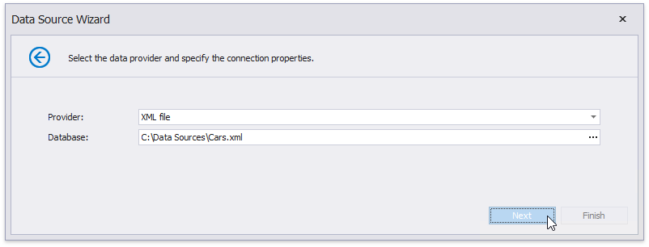
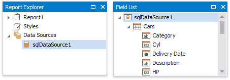

# Bind a Report to an XML File

This tutorial demonstrates how to bind a report to data stored in an external XML file:

1. [Create a new report](../add-new-reports.md).

2. Click the report's smart tag. In the invoked actions list, expand the drop-down menu for the **Data Source** property and click **Add Report DataSource**.
	
	

3. On the first page of the invoked [Data Source Wizard](../report-designer-tools/data-source-wizard.md), select **Database** and click **Next**.
	
	

5. The next page allows you to specify whether you want to use an existing data connection or create a new data connection. Select the first option and click **Next**.
	
	

6. On the next page, specify the data provider (**XML file**) and the path to the database file. 
	
	
	
	To proceed to the next wizard page, click **Next**.

7. On the next page, you can choose which tables, views and/or stored procedures to add to the report. You can also construct custom queries using the [Query Builder](../report-designer-tools/query-builder.md). Click **Finish** to exit the wizard.
	
	
	
	> [!NOTE]
	> Some of the data shaping capabilities available to SQL data sources (such as sorting, grouping and filtering data, as well as using aggregate functions) are not supported for XML files.

The newly created SQL data source will be displayed in the **Components** node of the [Report Explorer](../report-designer-tools/ui-panels/report-explorer.md). Additionally, the hierarchy of the data source will be reflected by the [Field List](../report-designer-tools/ui-panels/field-list.md).

