# Bind a Report to an XPO Persistent Object

This topic describes how to bind a report to XPO data at design time.

1. [Create a new report](../add-new-reports.md).

2. Click the report's smart tag. In the invoked action list, expand the drop-down menu for the **Data Source** property and click **Add New DataSource**.
	
	

    This invokes the [Data Source Wizard](../report-designer-tools/data-source-wizard.md).
3. Choose the **XPO** option and click **Next**.
	
	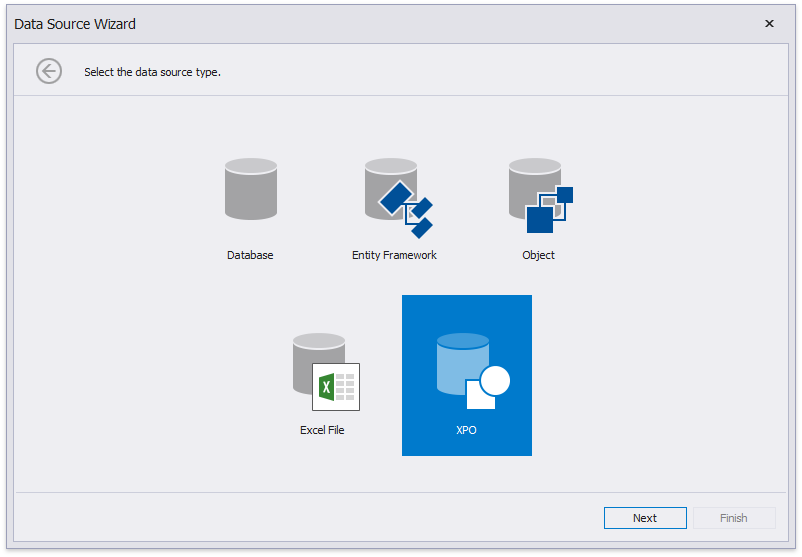

4. The following wizard page lists your application project's persistent object classes. Choose one entity type.

    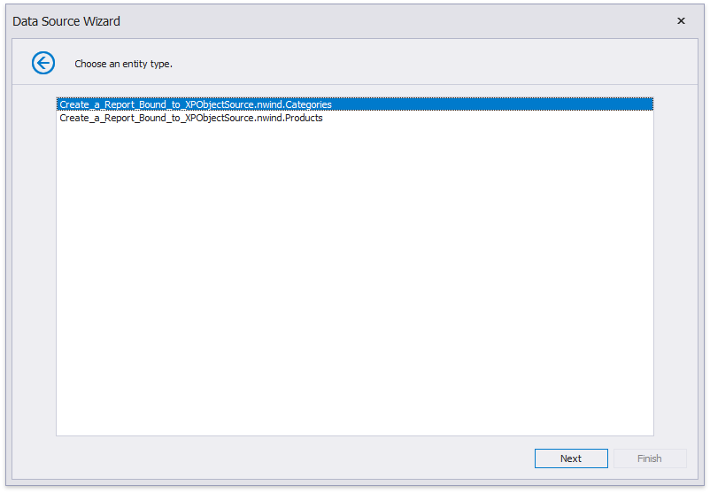

5. On the next page, specify whether to use an existing data connection or create a new data connection.
	
	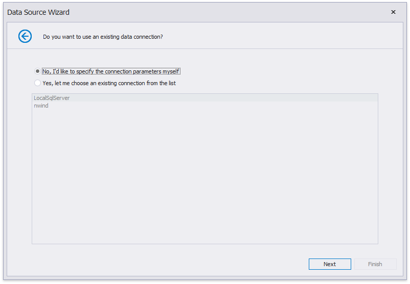
    
6. To create a new data connection, select a data provider or define a custom connection string.
	
    Specify provider-specific connection options (for example, the authentication type and database name).

    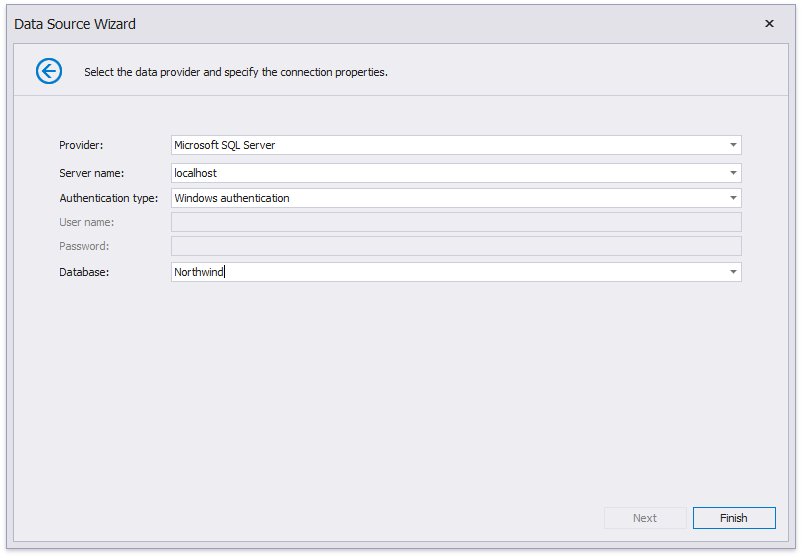

Finish the wizard. At this step, the wizard creates an **XPObjectSource** component. This component retrieves all the properties the chosen entity type includes. The [Field List](../report-designer-tools/ui-panels/field-list.md) reflects the data source structure.

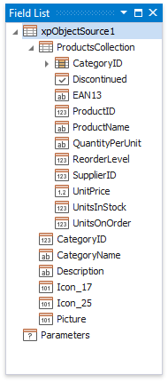

You can [customize the field list](#Change-the-Property-Set) and set up the component's settings after you finish the wizard.

## Customize Data Source Settings

You can customize the created **XPObjectSource** component's settings. To do this, select this component in the [Report Explorer](../report-designer-tools/ui-panels/Report-Explorer.md) and switch to the Property grid.

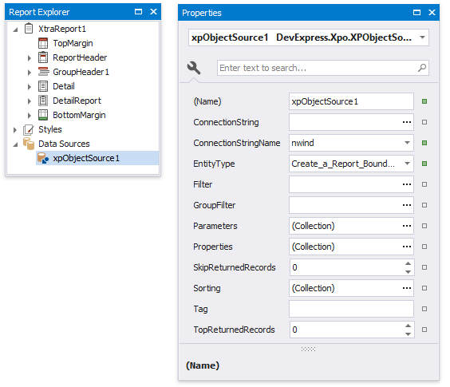

These settings allow you to specify which data to retrieve from the data source. 

> [!Note]
> Group/filter combinations and complex expressions support depends on the data source.

### Change the Connection Parameters

Use the **ConnectionStringName** property to change the connection string name only or the **ConnectionString** property to reconfigure a connection string. These properties are available in the Property Grid.

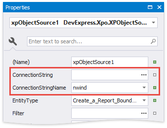

You can also right-click the **XPObjectSource** component in the Report Explorer and choose **Configure Connection...** to invoke the wizard and reconfigure the connection string.

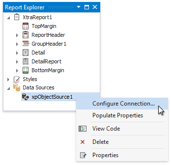

### Change the Entity Type

Use the **EntityType** property to specify another persistent object class.

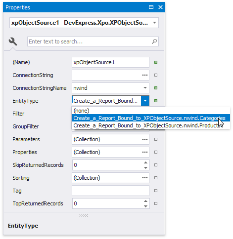

This reloads the Field List. It displays the fields that correspond to the the newly specified type. You can bind report elements to these fields.

### Change the Property Set

XPO loads all the persistent properties that the specified entity type exposes. You can use the **XPObjectSource** component's **Properties** property to customize the properties set.

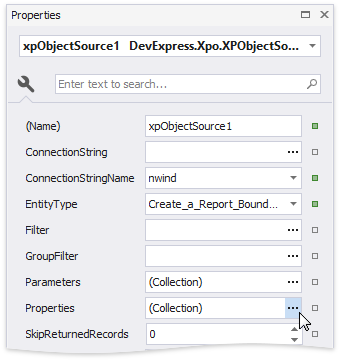

Click the **Properties** property's ellipsis button. This invokes the **Properties Collection Editor**.

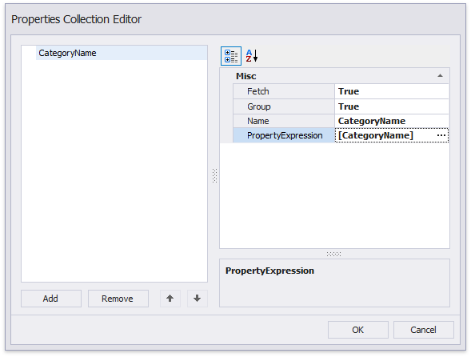

You can specify the following options for the newly added properties:

- **Name**  
    The name that you use to access the property in the report.

- **PropertyExpression**  
    The entity's persistent property or an expression that you can construct using several properties. The expression is calculated on the server.

- **Group**  
    Indicates whether to use this property to group data that XPO retrieves from the server.

- **Fetch**  
    Indicates whether to retrieve data for this property from the server.    

> [!Note]
> At least one property in the **Properties** collection must have an enabled **Fetch** property.

Use the **Clear Properties** command to clear the **Properties** collection and the **Populate Properties** command to add all the properties the entity type exposes.

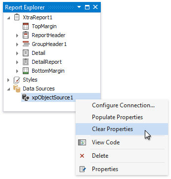

The Field List contains the fields that correspond to the **Properties** collection's properties. If this collection is empty, the Field List reflects the data source structure.

### Retrieve Filtered Data

Use the **XPObjectSource**'s **Filter** property to specify a filter expression for the data XPO retrieves from the data source.

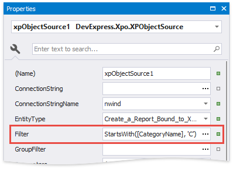

### Retrieve Sorted Data

Use the **XPObjectSource**'s **Sorting** property to specify sort settings for the retrieved data. 

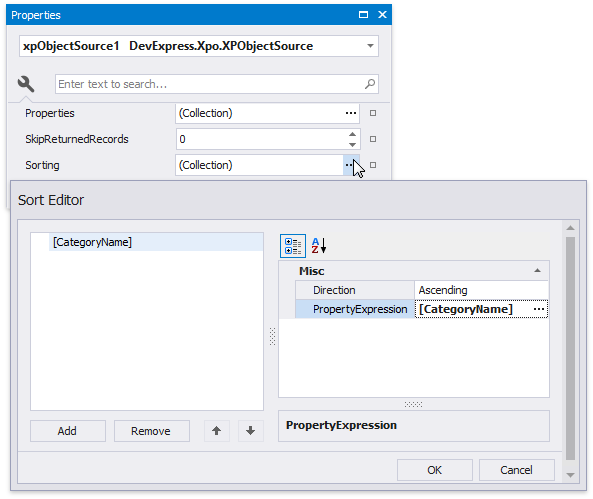

The **XPObjectSource** supports multiple column sorting. You can also specify a sorting expression for the data XPO retrieves from the data source.

### Retrieve Filtered Groups

Use the **XPObjectSource**'s **GroupFilter property to filter data on the server against values of the [grouped properties](#change-the-property-set). 

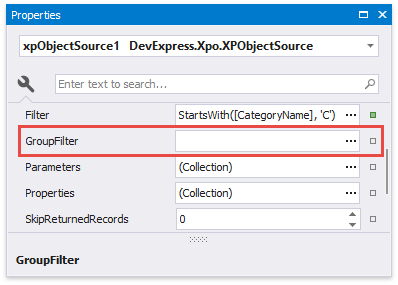

> [!Note]
> The **Group Filter** property is available when the **Properties** collection in not empty and has at least one property with an enabled **Group** flag.

### Limit the Retrieved Records' Number

Use the following properties to limit the number of records XPO retrieves from the server:

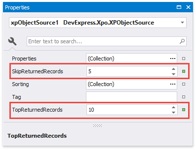

- **Top Returned Records**  
    Specifies the number of the top records in the data source XPO retrieves for the report.

- **Skip Returned Records**   
    Specifies the number of top records in the data source XPO skips when it retrieves data for the report.

> [!Note]
> The **XPObjectSource** does not process the zero value.

### Specify Query Parameters

You can define parameters and use them in **Properties**, **Filter**, **Sorting** and **GroupFilter** expressions.

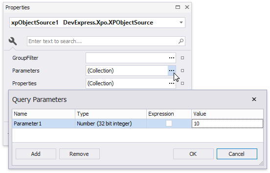

The following properties are available for each query parameter:

- **Name**  
    Specifies the parameter's name.
- **Type**  
    Specifies the parameter value's data type.
- **Expression**  
    Determines whether the actual parameter value is static or generated dynamically.
- **Value**  
    Specifies the query parameter's actual value (a static or dynamically calculated). If the **Expression** option is enabled, you can assign a report parameter or an expression that can also include a report parameter.

You can set a parameter to a static value or generate it dynamically based on an associated expression. 

- _Specify a static value_  

    Choose a query parameter's value type and set a static value to the **Value** property according to the selected type.

    

- _Provide a dynamic value_  

    Activate the Expression checkbox for a parameter.

    

    The following three options are available to dynamically calculate the parameter's actual value:

    - Select **Expression Editor** to construct an expression in the invoked Expression Editor.

    - Selecting **New Report Parameter** to create a new report parameter and map it to the query parameter. Ensure the report parameter's type corresponds to the query parameter's type.

    - Select an existing report parameter and map it to the query parameter.

