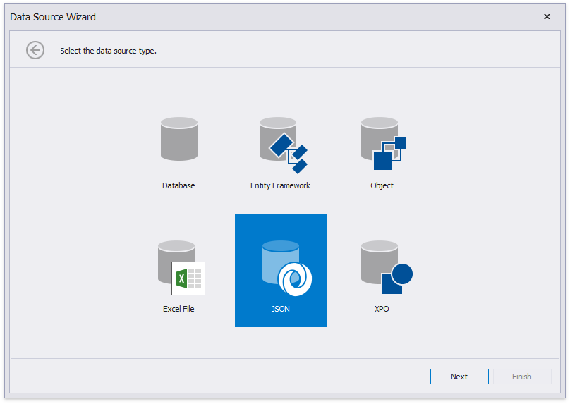
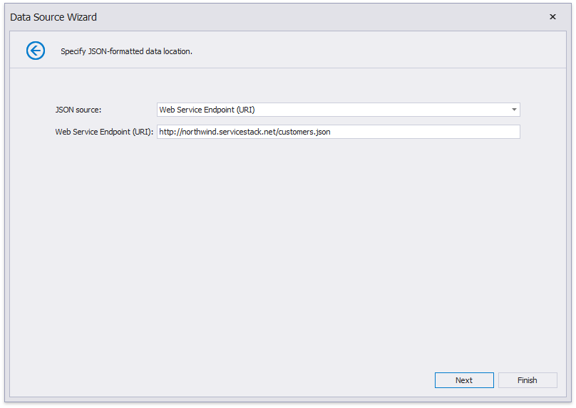
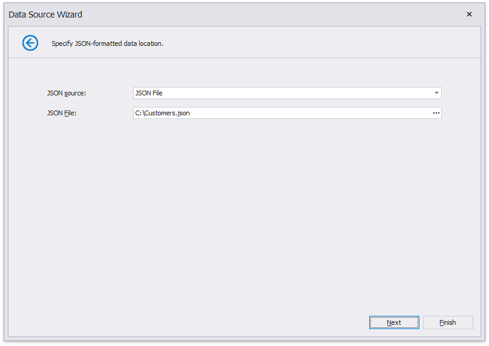
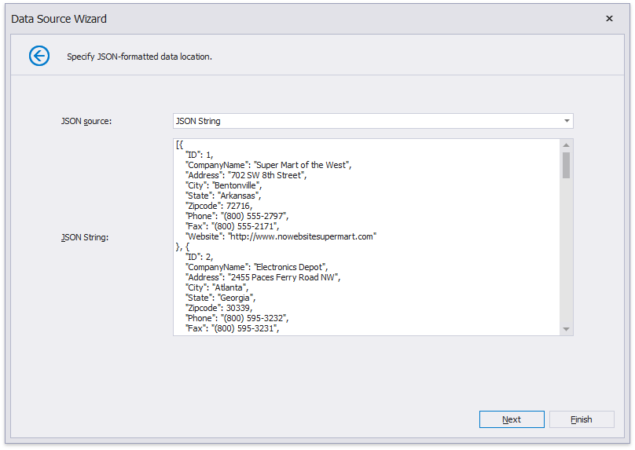
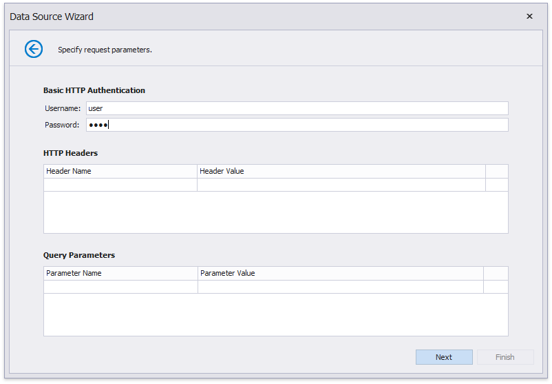
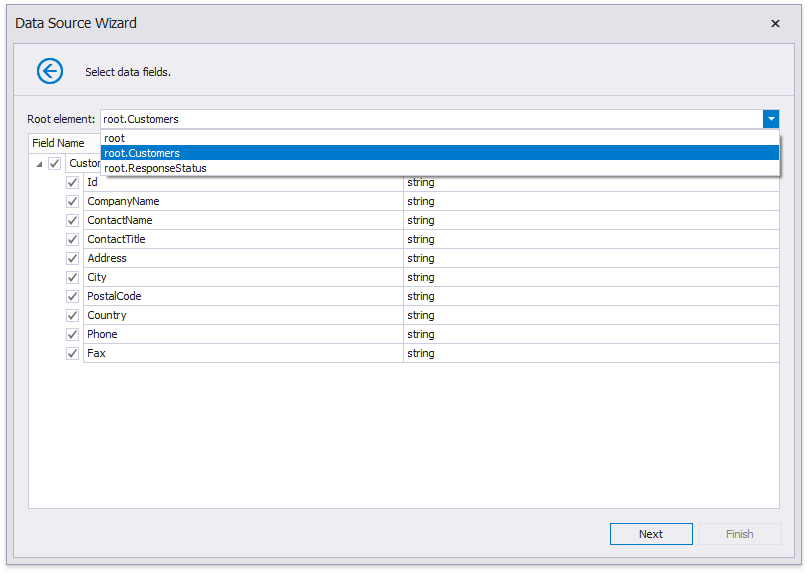
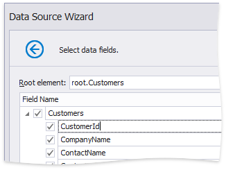
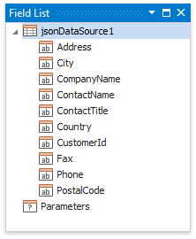
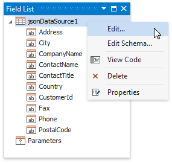
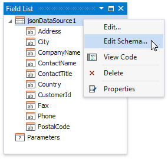

# Bind a Report to JSON Data

This topic describes how to bind a report to JSON data at design time.

## Create JsonDataSource

1. [Create a new report](../add-new-reports.md).

2. Click the report's smart tag. In the invoked actions list, expand the drop-down menu for the **DataSource** property and click **Add New Data Source...**
	
	

    This invokes the [Data Source Wizard](../report-designer-tools/data-source-wizard.md).

3. Choose the **JSON** option and click **Next**.
	
	

    > [!Note]
    > The Report Designer's Report Wizard provides the JSON option if the application has a reference to the open-source Newtonsoft.Json library.

4. The next wizard page allows you to specify the location of the JSON-formatted data:

    - Web Service Endpoint URI

        

    - File Name

        

    - String with JSON Content

         

    If you choose the **Web Service Endpoint** option, you can configure a connection string on the next wizard pages.

    4.1. Specify request parameters.

    

    > [!Tip]
    > Specify the Basic HTTP Authentication parameters or header parameters to access JSON data.

5. On the next page, the wizard shows the specified JSON data's structure. You can choose all nodes or a subset of nodes.

    

    Uncheck the data fields that your report does not require.

    You can rename data fields if necessary.

    

After you finish the wizard, it creates the **JsonDataSource** component. This component retrieves the checked data fields that the selected JSON element includes. The [Field List](..\report-designer-tools\ui-panels\field-list.md) reflects the data source structure.
 

## Customize the JSON Data Source

Right-click the **JsonDataSource** component in the Field List or Report Explorer and choose **Edit...**. Specify another JSON data location and reconfigure data fields in the invoked wizard.

## Customize the JSON Data Source Schema

Right-click the **JsonDataSource** component in the Report Explorer and choose **Edit Schema...**. Reconfigure data fields in the invoked wizard page.

